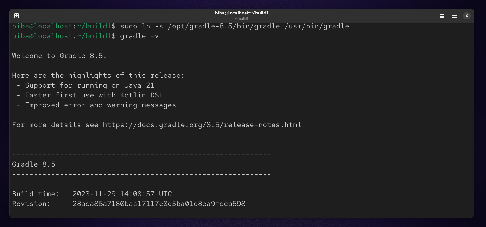
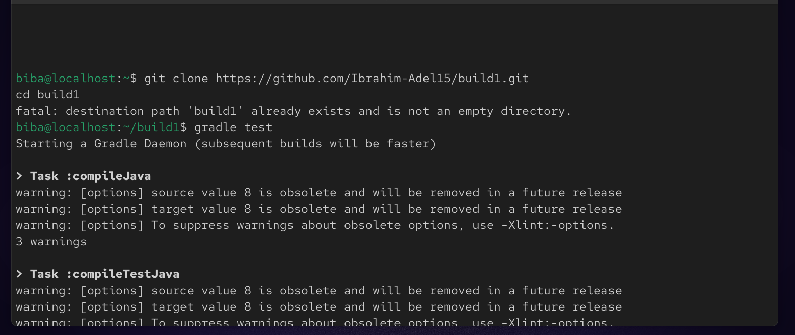
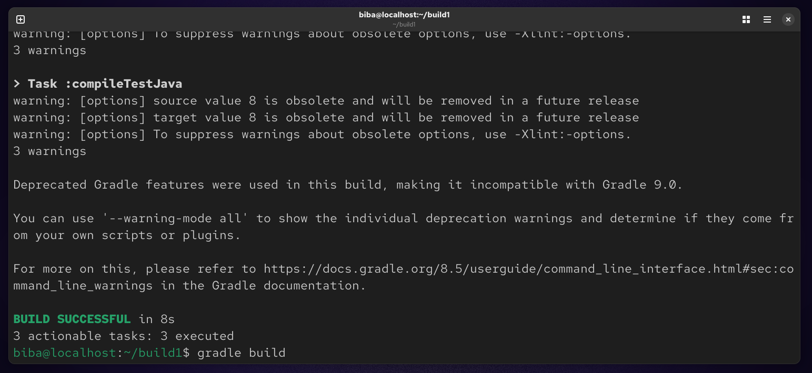
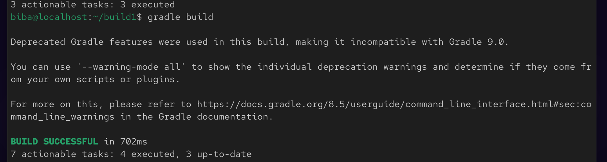
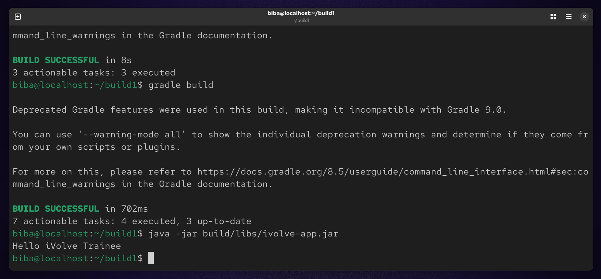

# Lab 1 : Building and Packaging Java Applications with Gradle

This lab focuses on building, testing, and running a Java application using Gradle. You will learn how to generate a deployable artifact and verify that the application works correctly.

## Objectives

- Install and configure Gradle
- Clone a Java project from GitHub
- Run unit tests
- Build the application and generate a JAR file
- Execute the application
- Verify the application is working
  
## Project Setup
### 1. Install Gradle
```
gradle -v
```


### 2. Clone the Repository
```
git clone https://github.com/Ibrahim-Adel15/build1.git
cd build1
```


### 3. Run Unit Tests
```
gradle test
```


### 4. Build the Application
```
gradle build
```


### 5. Run the Application
```
java -jar build/libs/ivolve-app.jar
```


### 📝 Summary

In this lab, we used Gradle to manage the build lifecycle of a Java application. We cloned the project, executed unit tests to validate functionality, and generated a deployable JAR artifact. Finally, we ran the application and verified its behavior.

This lab demonstrates key concepts such as build automation, dependency management, testing, and packaging in modern Java development workflows.


