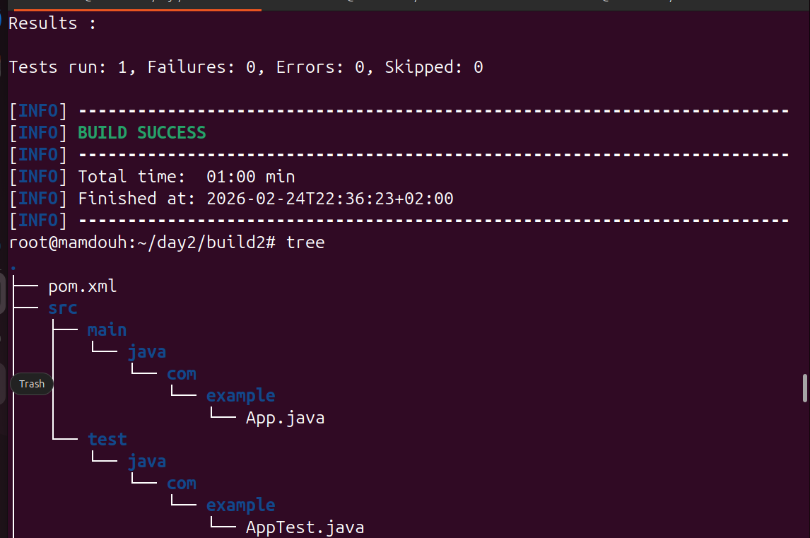
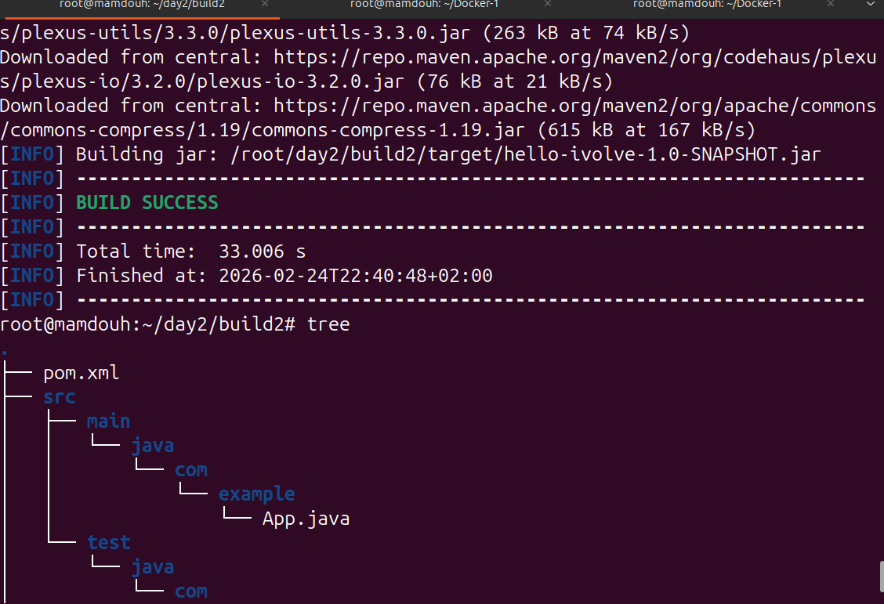
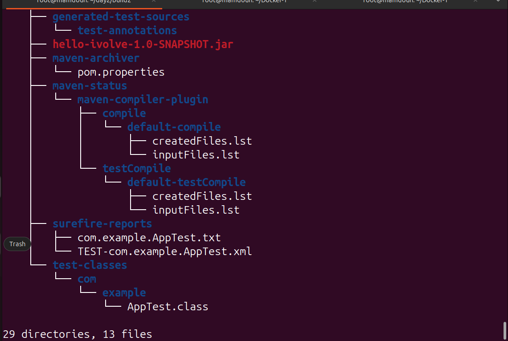
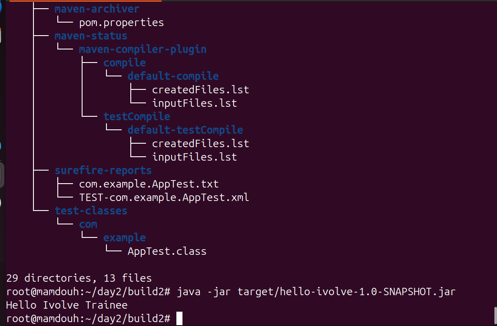

# Lab 2: Building and Packaging Java Applications with Maven

This project demonstrates the fundamental workflow of a DevOps engineer or Java developer using **Apache Maven**. It covers the entire lifecycle from cloning the source code to running unit tests, packaging the application, and executing the final artifact.

---

## 📋 Prerequisites

Before you begin, ensure you have the following installed:
* **Java Development Kit (JDK):** Version 8 or higher.
* **Apache Maven:** Version 3.6.x or higher.
* **Git:** To clone the repository.

---

## 🚀 Steps to Reproduce

### 1. Install Maven
If you haven't installed Maven yet, follow these commands (for Ubuntu/Linux):
```bash
sudo apt update
sudo apt install maven -y
mvn -version
```
  
 ### 2. Clone the Repository
Clone the source code from the official repository:
```bash
git clone [https://github.com/Ibrahim-Adel15/build2.git](https://github.com/Ibrahim-Adel15/build2.git)
cd build2
```

### 3. Run Unit Tests
Validate the code logic by running the pre-defined unit tests:
```bash
mvn test
```

### 4. Build the Application
Generate the executable JAR file (Artifact) in the target/ directory:
```bash
mvn package
```

### 5. Run the Application
Execute the generated JAR file using the Java runtime:
```bash
java -jar target/hello-ivolve-1.0-SNAPSHOT.jar
```



✅ Verification
To verify the application is working correctly:
Ensure the mvn package command ends with a BUILD SUCCESS message.
After running the JAR file, check the terminal output for the expected message (e.g., "Hello iVolve!").


🛠 Technologies Used
Java: The core programming language.
Maven: Build automation and dependency management.
JUnit: For running unit tests.
GitHub: Version control and source code hosting.


