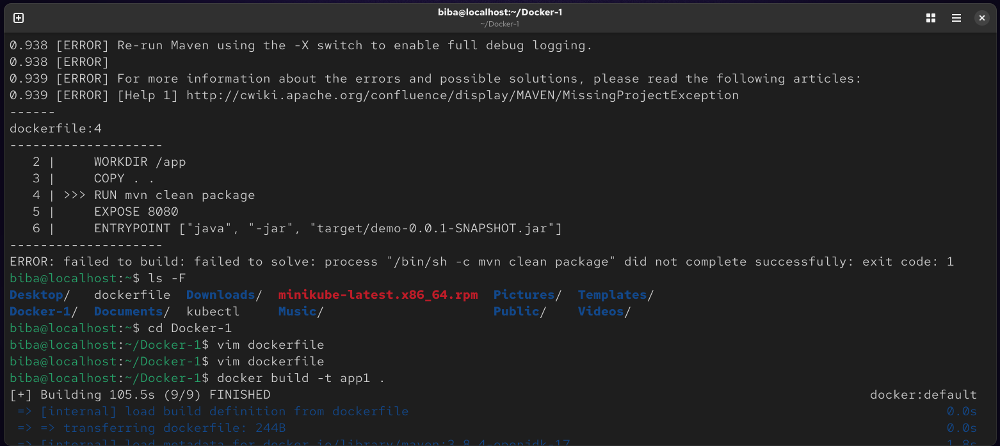
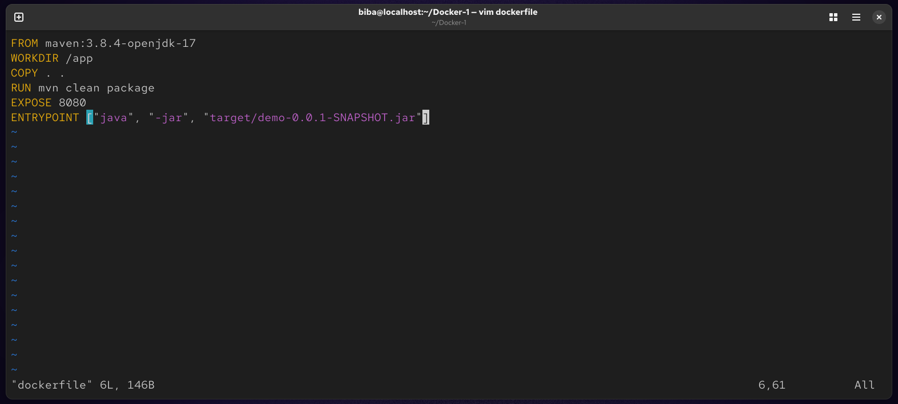
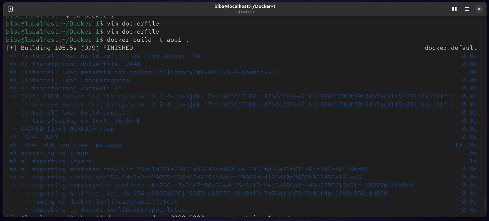

# Lab 3: Containerizing a Java Spring Boot Application

This laboratory focuses on the process of containerizing a Java Spring Boot application using Docker. You will learn how to write a Dockerfile, build an image, and manage the lifecycle of a container.

## 📋 Prerequisites

* **Docker** installed and running on your machine.
* **Git** installed for cloning the repository.
* Basic understanding of Docker commands and Java application structure.

## 🚀 Lab Objectives

1.  Clone the application source code.
2.  Develop a professional `Dockerfile` using a Maven base image.
3.  Build a Docker image from the source code.
4.  Run and test the application within a container.
5.  Cleanup the environment.

---

## 🛠️ Step-by-Step Instructions

### 1. Clone the Application Code
Start by cloning the repository to your local environment :
```bash
git clone [https://github.com/Ibrahim-Adel15/Docker-1.git](https://github.com/Ibrahim-Adel15/Docker-1.git)
cd Docker-1
```
 

### 2. Create the Dockerfile
Create a file named Dockerfile in the root directory of the project :
```
vim dockerfile
```


### 3. Build the Docker Image
Build the image and name it app1 :
```
docker build -t app1 .
```



