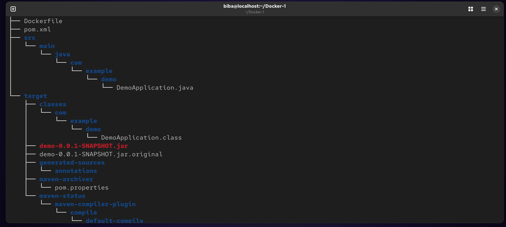
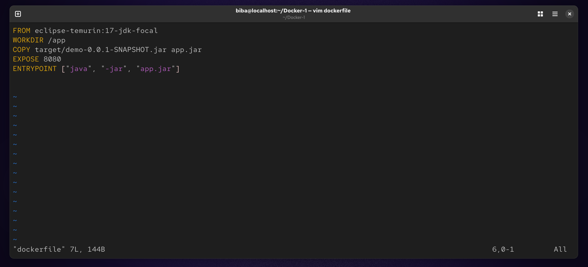
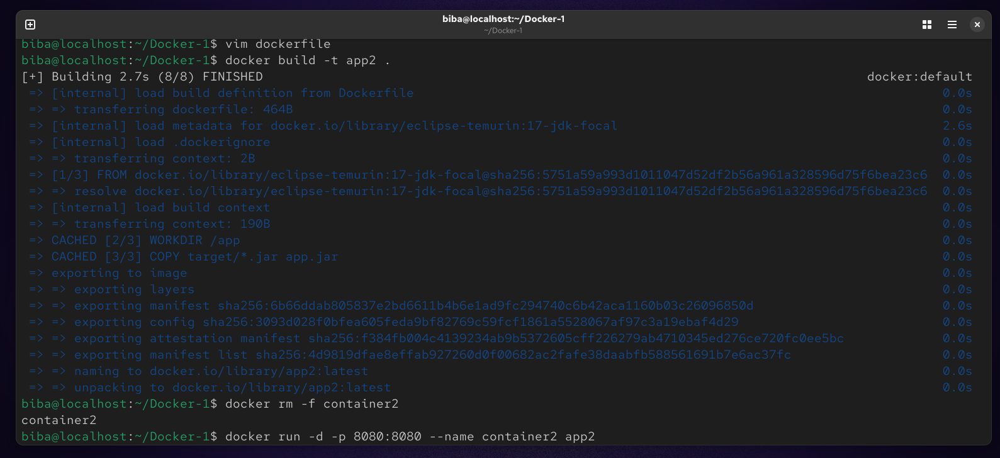
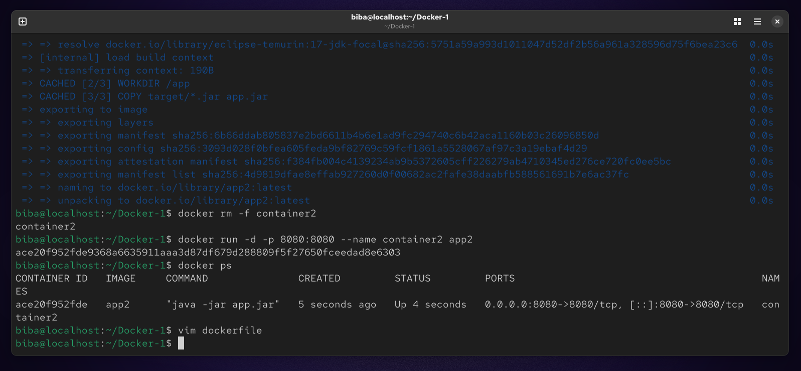
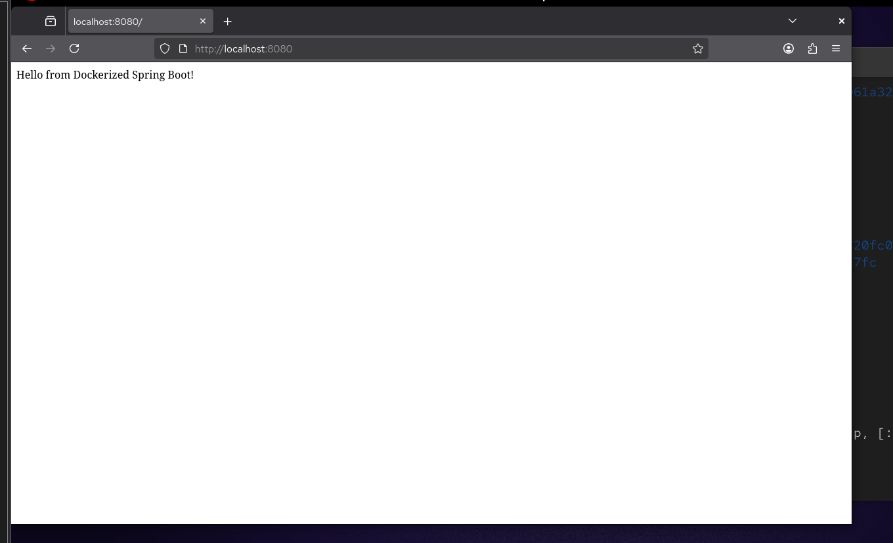
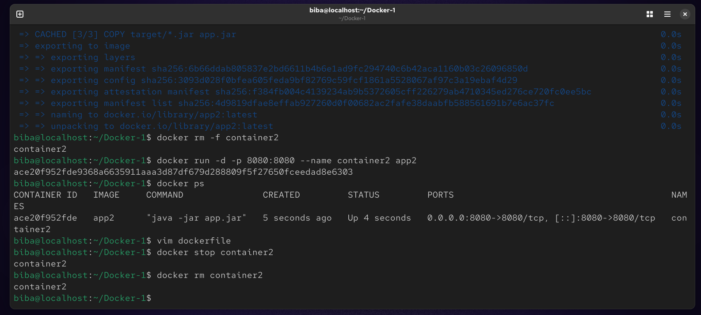

# Lab 4: Dockerizing a Java Spring Boot Application

This project demonstrates how to containerize a Java Spring Boot application using Docker by copying a pre-built JAR file into a lightweight Java Runtime Environment (JRE) image.

## Prerequisites
* Docker installed on your machine.
* Java Spring Boot project source code.
* `demo-0.0.1-SNAPSHOT.jar` file located in the `target/` directory.

## 1. Project Structure
```
.
├── dockerfile
├── pom.xml
├── src/
└── target/
    └── demo-0.0.1-SNAPSHOT.jar
```


## 2. Dockerfile Configuration
The dockerfile contains the following instructions to build the image :
```
vim dockerfile
```


## 3. How to Run
### Step 1: Build the Docker Image
Run this command in the terminal to create the image named app2 :
```
docker build -t app2 .
```


### Step 2: Run the Container
Start the container named container2 and map port 8080 :
```
docker run -d -p 8080:8080 --name container2 app2
```


## 4. Test the Application
Open your web browser or use curl to verify the application is running:
```
URL: http://localhost:8080
Command: curl http://localhost:8080
```


## 5. Cleanup
Once you have finished testing, stop and remove the container :
```
docker stop container1
docker rm container1
```
 

