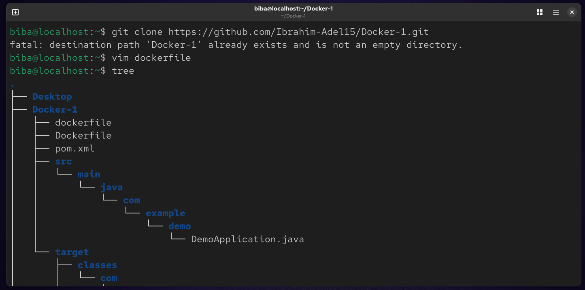
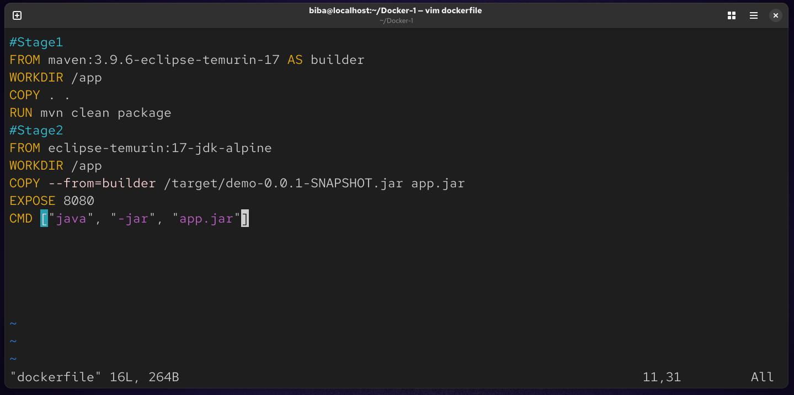

# Lab 5 : Multi-Stage Build for a Node.js App
This repository demonstrates the implementation of a Multi-Stage Dockerfile to build and run an application efficiently. By utilizing multi-stage builds, we optimize the final image size by separating the compilation environment from the execution environment.

## 🚀 Project Objectives
Stage 1 (Build): Use a Maven base image to compile the source code and package it into a JAR file.

Stage 2 (Run): Use a lightweight Java Runtime (JRE) image to run the application, keeping the final image slim and secure.

### 🛠️ Implementation Steps
1. Clone the Source Code
Start by cloning the application repository to your local environment:
```
git clone https://github.com/Ibrahim-Adel15/Docker-1.git
cd Docker-1
```


### 2. Dockerfile Configuration
Create a Dockerfile in the root directory with the following multi-stage setup:
```
vim dockerfile
```

