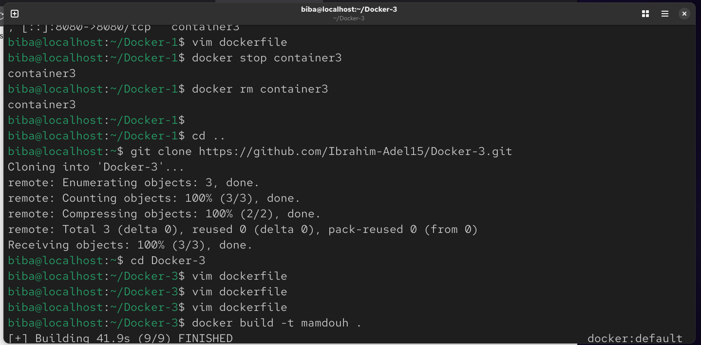
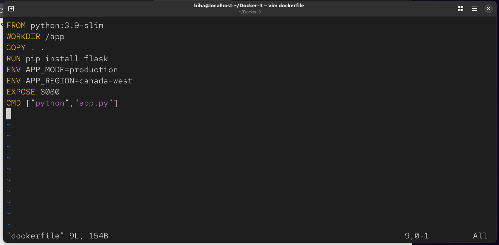

# Lab 6 : Managing Docker Environment Variables Across Build and Runtime
This repository demonstrates the practical application of managing environment variables within Docker containers using three different methods: Direct CLI Flags, Environment Files, and Dockerfile ENV instructions.

## 🚀 Objectives
Containerize a Python Flask application.

Understand the precedence and scope of environment variables.

Practice different ways to inject configurations into running containers.

### 🛠️ Implementation Steps
1. Environment Setup
Clone the source code from the repository:
```
git clone https://github.com/Ibrahim-Adel15/Docker-3.git
cd Docker-3
```


### 2. Dockerfile Configuration
The Dockerfile is configured with a base Python image and includes default environment variables for the production environment.
```
vim dockerfile
```



