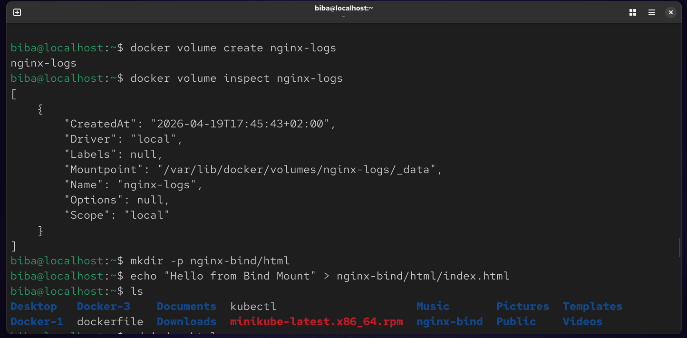
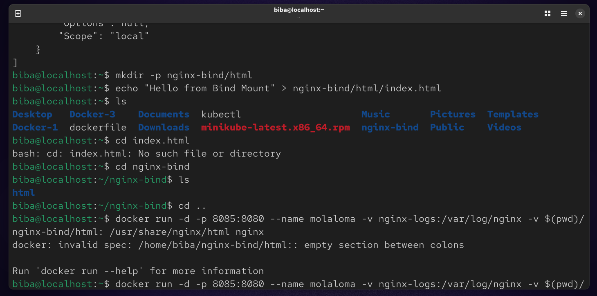
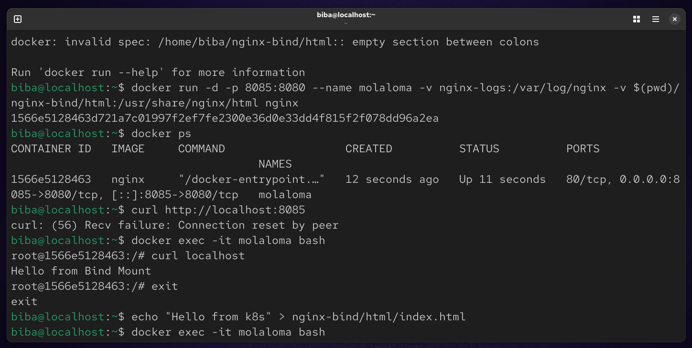
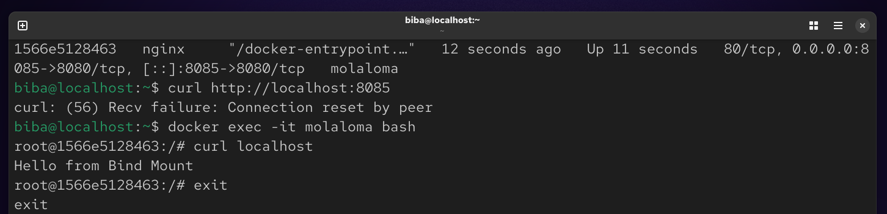
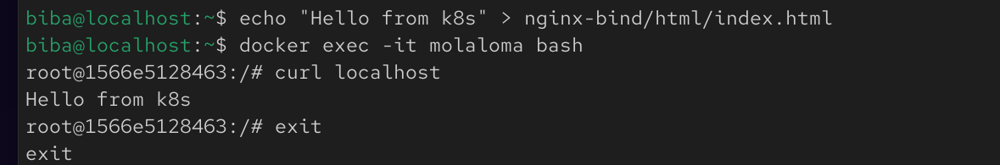
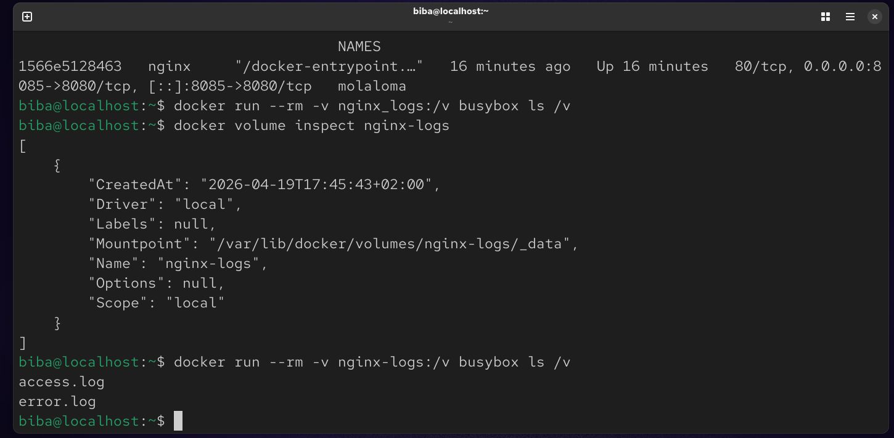

# Lab 7 : Docker Storage Management (Volumes vs. Bind Mounts)
This lab demonstrates how to manage persistent data in Docker using Named Volumes for logs and Bind Mounts for custom web content.

## 🚀 Overview
In this lab, we use an Nginx server to explore two types of storage:

1. Docker Volume: Used for /var/log/nginx to ensure logs persist even if the container is deleted.

2. Bind Mount: Used for /usr/share/nginx/html to link a local directory on your host to the container for real-time code updates.

### 🛠️ Step-by-Step Implementation
1. Create a Managed Volume
Create a volume named nginx_logs to store Nginx access and error logs.
```
docker volume create nginx_logs
```


### 2. Prepare the Host Directory (Bind Mount)
Create a directory structure on your local machine and add a custom HTML file.
```
mkdir -p nginx-bind/html
echo "Hello from Bind Mount" > nginx-bind/html/index.html
```


### 3. Run the Container
Launch the Nginx container with both storage types mounted.
```
docker run -d -p 8085:8080 --name molaloma -v nginx-logs:/var/log/nginx -v $(pwd)/nginx-bind/html:/usr/share/nginx/html nginx
```


### 🧪 Verification & Testing
✅ Test Bind Mount (Real-time updates)
Check the initial content:
```
curl http://localhost:8085
```


### Update the file on your host machine and check again without restarting:
```
echo "Hello from k8s" > nginx-bind/html/index.html
curl http://localhost:8085
```


### ✅ Verify Persistent Logs (Volume)
Check if logs are being stored inside the nginx_logs volume:
```
docker run --rm -v nginx-logs:/v busybox ls /v
```



