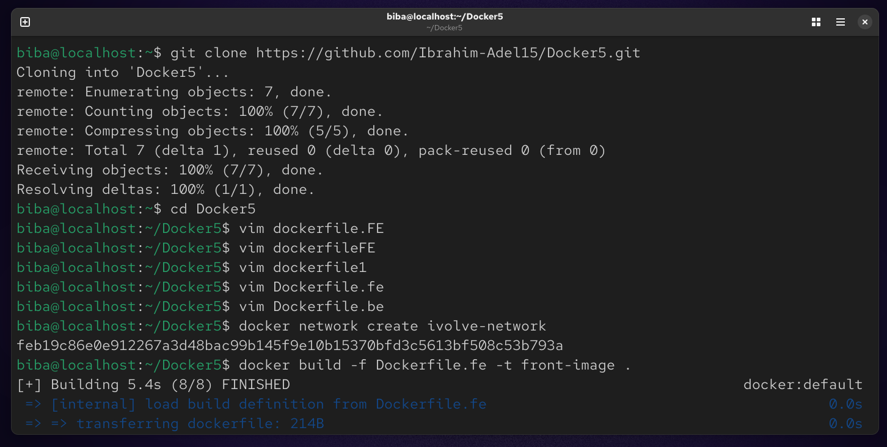
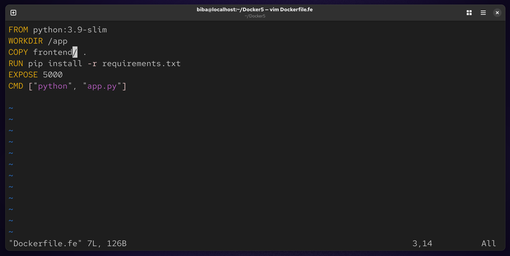
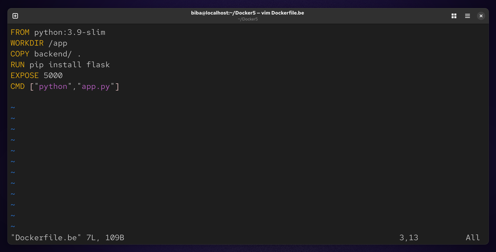
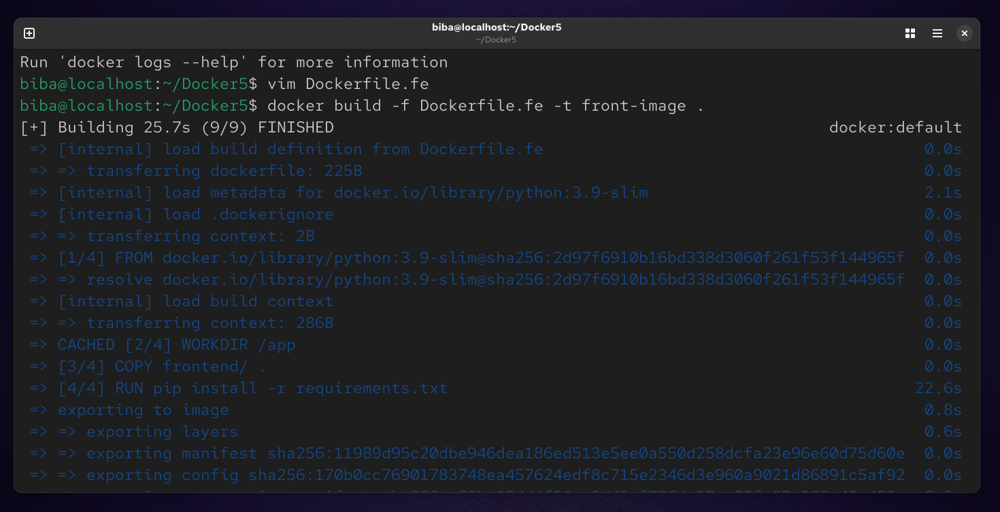
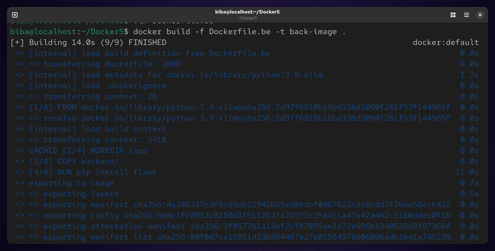
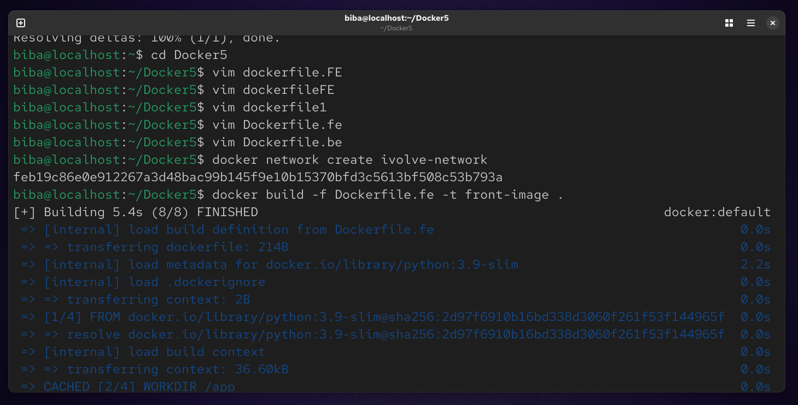
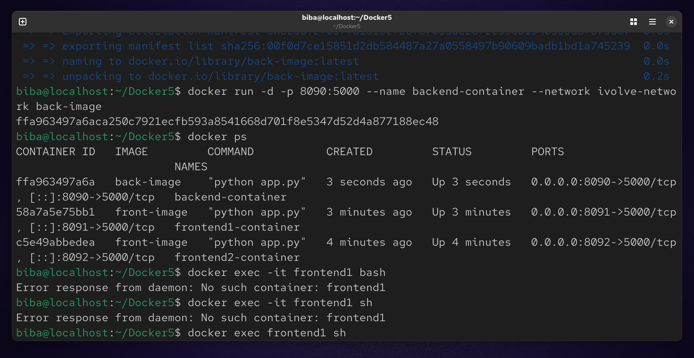
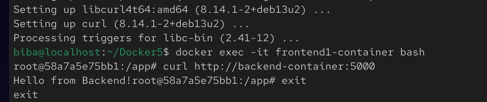

# Lab 8 : Custom Docker Network for Microservices

## 📝 Lab Description
Implementation of a custom Docker bridge network to enable communication between a Flask Backend and two Frontend instances, while demonstrating network isolation.

### 🛠️ Step 1 : clone repo from github
```
git clone https://github.com/Ibrahim-Adel15/Docker5.git
cd Docker5
```


### 🛠️ Step 2 : Preparation of Dockerfiles
#### 1. Frontend Dockerfile (Dockerfile.fe)
#### 2. Backend Dockerfile (Dockerfile.be)
```
vim Dockerfile.fe
vim Dockerfile.be
```




### 🛠️ Step 3 : Deployment & Networking
#### 1. Build Images
```
docker build -f Dockerfile.fe -t front-iamge .
docker build -f Dockerfile.be -t back-image .
```




#### 2. Create Custom Network
```
docker network create ivolve-network
```


#### 3. Run Containers
```
docker run -d -p 8091:5000 --name frontend1-container --network ivolve-network front-image 
docker run -d -p 8092:5000 --name frontend2-container front-image
docker run -d -p 8090:5000 --name backend-container --network ivolve-network back-image
docker ps
```


### 🧪 Step 4 : Verification (Communication Test)
✅ Test Frontend 1 (Success)
Verify connectivity between frontend1 and backend:
```
docker exec -it frontend1-container bash
curl http://backend-container:5000
```



