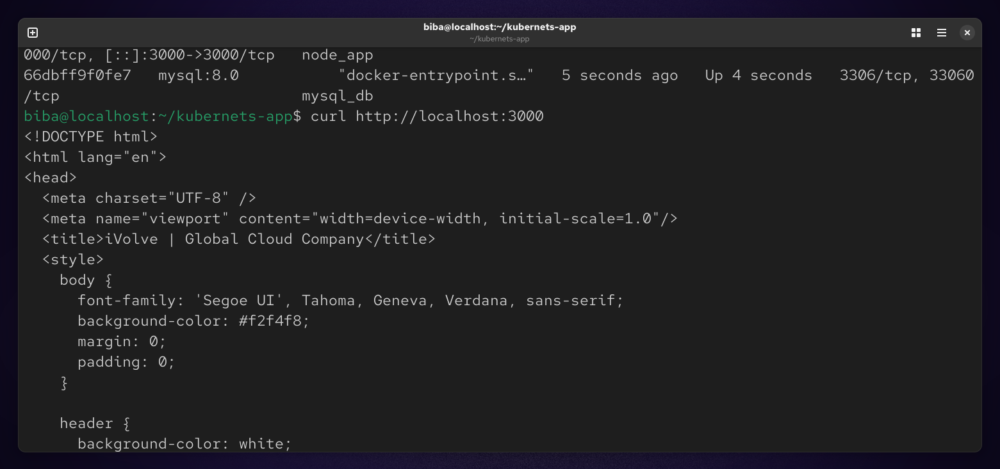
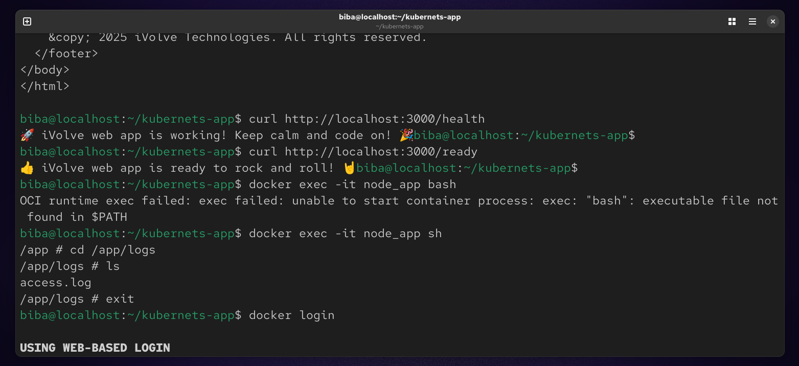
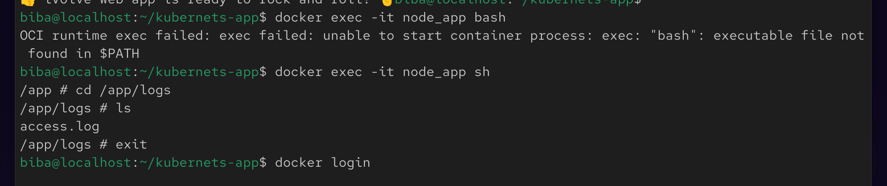
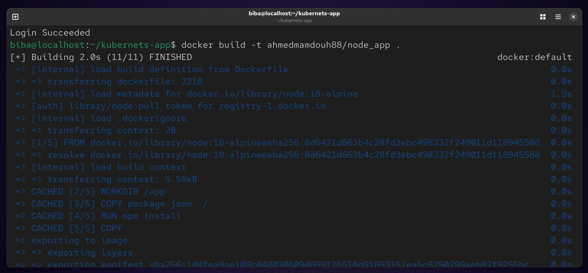
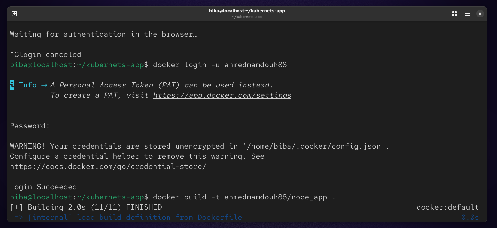
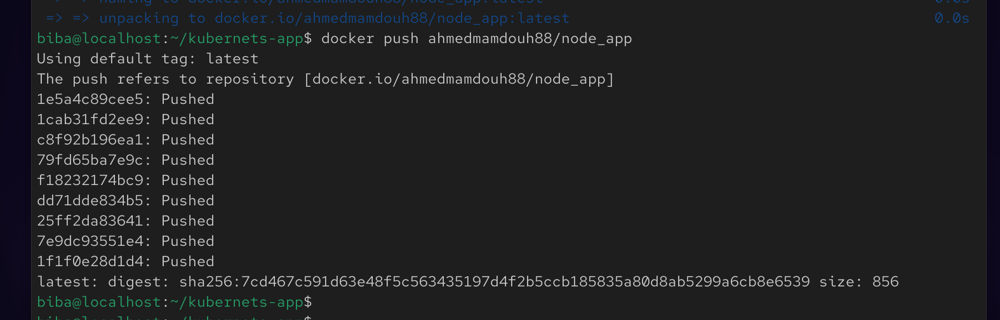

#  Lab 9 : Containerized Node.js & MySQL Stack Using Docker Compose

This lab demonstrates how to containerize a Node.js application and connect it to a MySQL database using Docker Compose. The goal is to build, run, and validate a multi-container application, then push the final image to Docker Hub.

## Objectives

- Clone and run a Node.js application
- Configure a MySQL database container
- Connect the application to the database
- Use Docker Compose for orchestration
- Validate application health and logs
- Push the Docker image to Docker Hub

##  Project Setup
### 1. Clone the Repository
```
git clone https://github.com/Ibrahim-Adel15/kubernets-app.git
cd kubernets-app
```


### 2. Create a docker-compose.yml file in the project root:
```
vim docker-compose.yml
```


### 3. Running the Application
```
docker compose up -d --build
```


### 4. Verification
#### 1. Verify Application is Running
```
http://localhost:3000
```


#### 2. Health Check Endpoints
```
http://localhost:3000/health
http://localhost:3000/ready
```


### 5. Check Application Logs
```
docker exec -it node_app sh
cd /app/logs
ls
```


### 6. Push Image to Docker Hub
#### 1. Build Image
```
docker build -t ahmedmamdouh88/node_app .
```


#### 2. Login to Docker Hub
```
docker login -u ahmedmamdouh88
```


#### 3. Push Image
```
docker push ahmedmamdouh88/node_app
```


### 📝 Summary
In this lab, we successfully containerized a Node.js application and connected it to a MySQL database using Docker Compose. We defined a multi-service architecture where both the application and database run in isolated containers, enabling better scalability and maintainability.
The application was configured using environment variables to establish a reliable database connection, and a persistent Docker volume was used to ensure that MySQL data is retained across container restarts.
We verified the system by checking application endpoints, including health and readiness routes, and inspecting logs to confirm proper operation. Finally, the application image was built and prepared for distribution by pushing it to Docker Hub.
This lab highlights essential DevOps practices such as containerization, service orchestration, configuration management, and deployment workflows.


