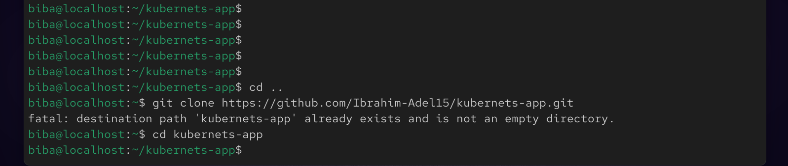
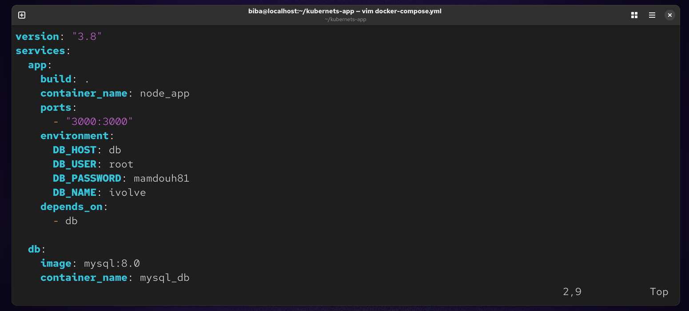
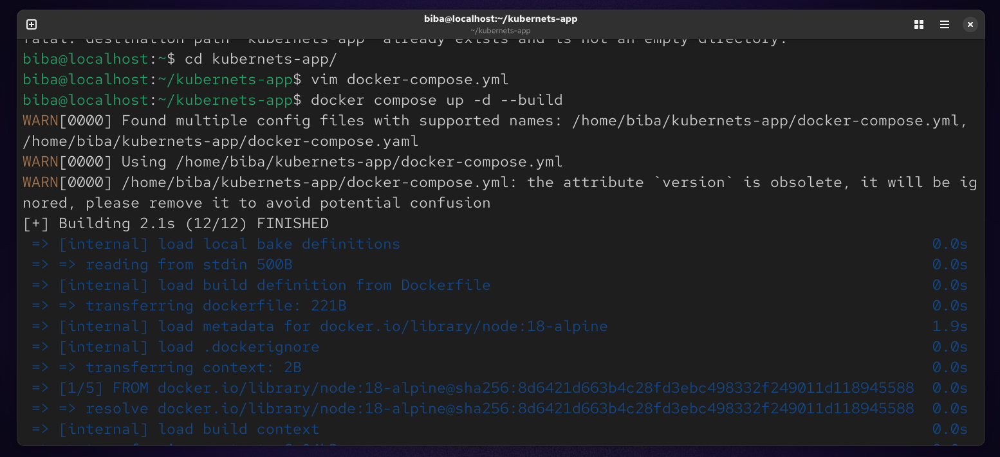

#  Lab 9 : Containerized Node.js & MySQL Stack Using Docker Compose

This lab demonstrates how to containerize a Node.js application and connect it to a MySQL database using Docker Compose. The goal is to build, run, and validate a multi-container application, then push the final image to Docker Hub.

## Objectives

- Clone and run a Node.js application
- Configure a MySQL database container
- Connect the application to the database
- Use Docker Compose for orchestration
- Validate application health and logs
- Push the Docker image to Docker Hub

##  Project Setup
### 1. Clone the Repository
```
git clone https://github.com/Ibrahim-Adel15/kubernets-app.git
cd kubernets-app
```


### 2. Create a docker-compose.yml file in the project root:
```
vim docker-compose.yml
```


### Running the Application
```
docker compose up -d --build
```



