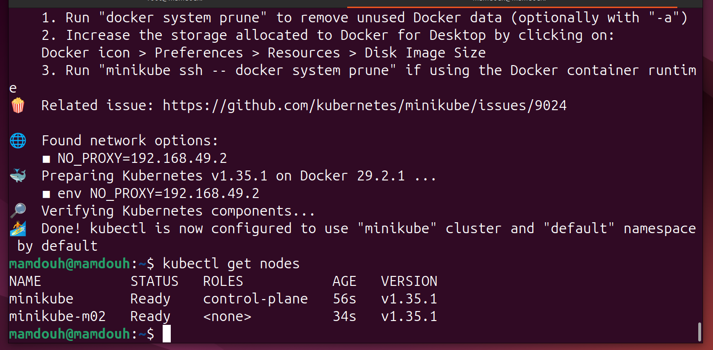
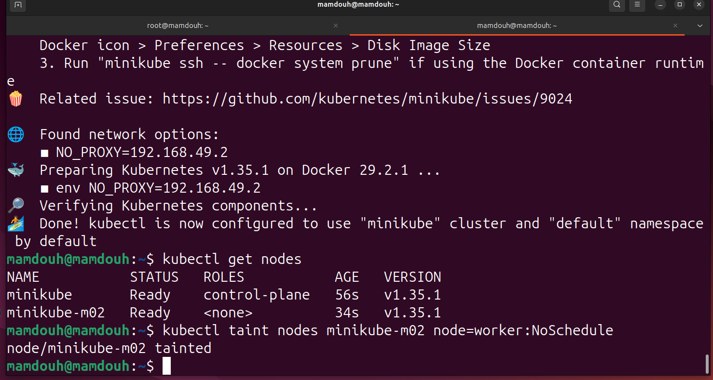
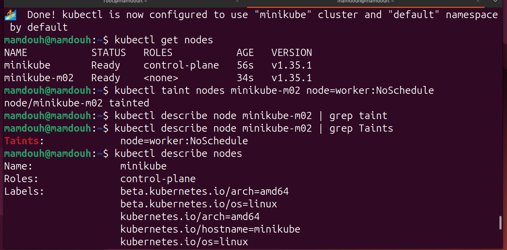

# Lab 10: Node Isolation Using Taints in Kubernetes

This project demonstrates the fundamental concept of Node Isolation in a Kubernetes cluster. It covers the entire workflow from provisioning a multi-node cluster to applying Taints and verifying how they control pod scheduling.

## 📋 Prerequisites

Before you begin, ensure you have the following installed:

    Minikube: Version 1.38.x or higher.

    kubectl: Version 1.35.x or higher.

    Docker: As the container runtime driver.
    
### 1. Provision a Multi-Node Cluster To demonstrate node isolation, we must have more than one node. Run the following command to start Minikube with 2 nodes:
```
minikube start --nodes 2
kubectl get nodes
```


### 2. Apply a Taint to the Worker Node We will apply a taint to the second node (minikube-m02). This taint uses a specific key-value pair and an effect that prevents standard pods from being scheduled on it.
```
kubectl taint nodes minikube-m02 node=worker:NoSchedule
```


### 3. Verify the Taint Configuration Use the describe command to confirm that the taint has been successfully applied to the node properties.
```
kubectl describe node minikube-m02 | grep Taints
```


#### 📝 Lab Summary

In this lab, I successfully implemented Node Isolation using Kubernetes Taints. Here is a summary of the technical achievements:
Cluster Infrastructure: Configured a local multi-node environment consisting of a Control Plane and a Worker Node.

1 - Cluster Infrastructure: Configured a local multi-node environment consisting of a Control Plane and a Worker Node.
2 - Resource Branding: Applied a Taint (node=worker:NoSchedule) which acts as a "repellant" for pods.
3 - Scheduling Logic: By using the NoSchedule effect, I ensured that the Kubernetes Scheduler will bypass this node for any standard deployment, effectively reserving the node for specialized workloads.
4 - Operational Efficiency: This technique is essential in production for isolating specific hardware (like GPUs) or dedicated nodes for critical system services.


