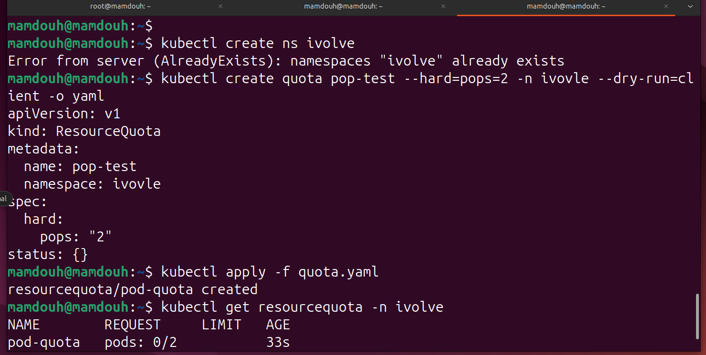
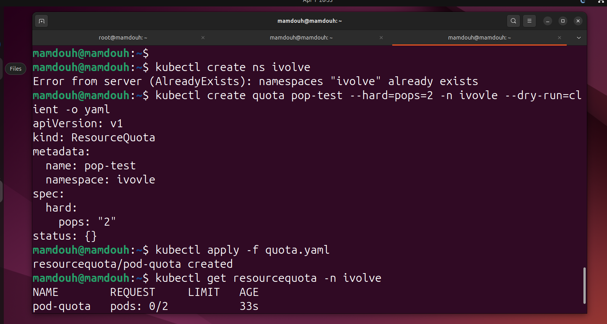
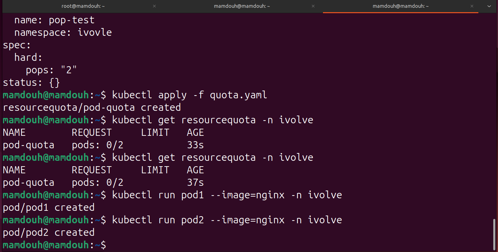
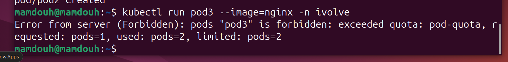

# Lab 11: Namespace Management and Resource Quota Enforcement

This lab demonstrates how to implement resource governance in Kubernetes by restricting the number of Pods within a specific Namespace.

## 📋 Project Overview

The goal is to create a logical isolation layer (Namespace) and enforce a ResourceQuota that limits the maximum number of Pods to 2. We will also verify the enforcement by attempting to exceed this limit.

### 1. Creating the Namespace

We started by creating a dedicated environment for our resources to ensure they are isolated from the rest of the cluster.
```
kubectl create namespace ivolve
kubectl get namespaces
```


### 2. Testing with Dry Run (The Blueprint)

Before applying the quota, we used a "Dry Run" to generate the YAML manifest. This allows us to preview the configuration without actually creating the resource.
```
kubectl create quota pop-test --hard=pods=2 -n ivolve --dry-run=client -o yaml
```


### 3. Applying the Resource Quota

After verifying the configuration, we applied the quota to the ivolve namespace using a YAML file.
```
kubectl apply -f quota.yaml
kubectl get resourcequota -n ivolve
kubectl run pod1 --image=nginx -n ivolve
kubectl run pod2 --image=nginx -n ivolve
```


### 4. Verifying Enforcement (The Stress Test)

To prove the quota works, we attempted to run 3 pods sequentially in the ivolve namespace.
```
kubectl run pod3 --image=nginx -n ivolve
```


#### 📝 Lab Summary & Key Learnings

1 - Logical Isolation: Created a clean workspace using Namespaces.

2 - Resource Governance: Successfully enforced a ResourceQuota to prevent resource exhaustion.

3 - Proactive Validation: Used --dry-run=client to validate configurations before deployment.

4 - Error Handling: Confirmed that Kubernetes strictly blocks any resource creation that violates the defined quota.

Why this matters in Production?

1 - Noisy Neighbor Prevention: Ensures one team's application doesn't hog all the cluster's capacity.

2 - Cost Management: Helps in limiting resources for non-production environments to save costs.


