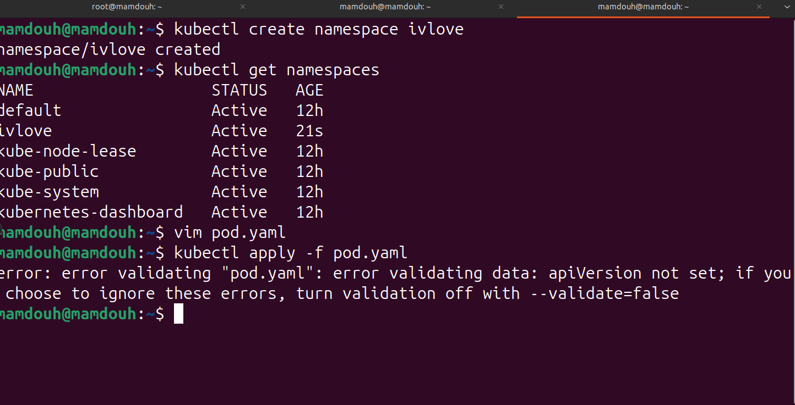
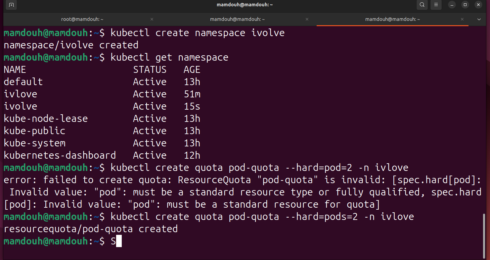

# Lab 11: Namespace Management and Resource Quota Enforcement
This project demonstrates how to implement Multi-tenancy and Resource Governance in a Kubernetes cluster. It covers the creation of a logical isolation layer 
(Namespace) and enforcing strict limits on the number of Pods allowed within that environment.

## 📋 Prerequisites

Before you begin, ensure you have the following:

    Kubernetes Cluster: Running (Minikube or Managed Cluster).

    kubectl: Installed and configured to interact with your cluster.

    Namespace Knowledge: Understanding of logical isolation in K8s.
### 1. Create a Custom Namespace
Namespaces are used to isolate resources for different projects or teams. We created a namespace named ivlove.
```
kubectl create namespace ivlove
kubectl get namespaces
```


### 2. Enforce Resource Quota
To prevent resource exhaustion, we applied a ResourceQuota to limit the total number of pods to exactly 2.
```
kubectl create quota pod-quota --hard=pods=2 -n ivlove
```


#### 📝 Lab Summary & Technical Analysis
What was achieved?

1 - Logical Isolation: Successfully partitioned the cluster using a dedicated Namespace (ivlove), ensuring a clean workspace.

2 - Resource Budgeting: Defined a Hard Limit policy using ResourceQuotas. This acts as a safeguard against accidental or malicious over-provisioning of resources.

3 - Troubleshooting Mastery :

1. Identified that Kubernetes is case-sensitive and strictly requires plural naming for resources (e.g., pods instead of pod).

2. Resolved NotFound errors by ensuring the correct namespace context was used during verification.

Production Use Cases:

1 - Cost Control: Preventing dev/test environments from consuming more resources than budgeted.

2 - Noisy Neighbor Prevention: Ensuring that a high-load application in one namespace doesn't starve other critical services of CPU/Memory or scheduling slots.
