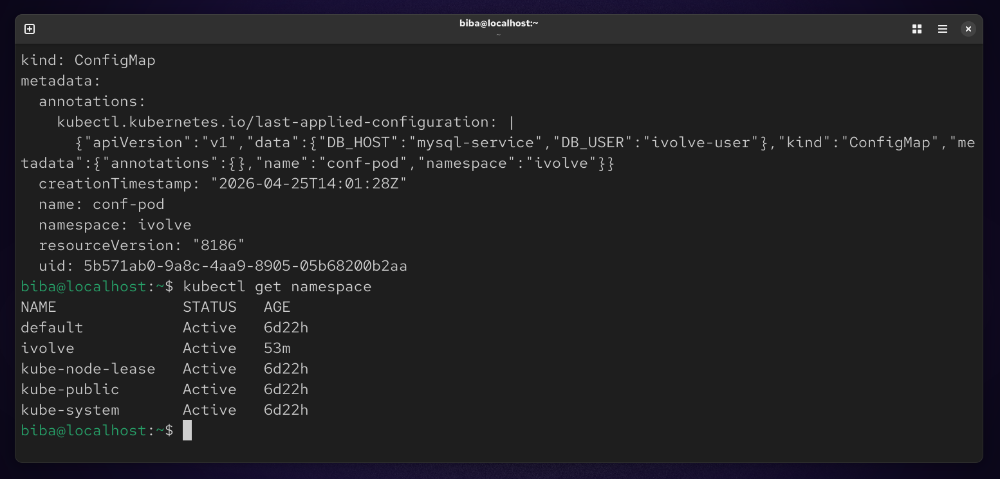

# 📦 Lab 12: Managing Configuration and Sensitive Data in Kubernetes

## 🎯 Objective
In this lab, we learn how to manage application configuration and sensitive data in Kubernetes using:

- **ConfigMaps** → for non-sensitive data  
- **Secrets** → for sensitive data

## 🧩 Part 1: Create a Namespace

First, create a namespace to isolate resources:
```
kubectl create namespace ivolve
kubectl get namespace
```



