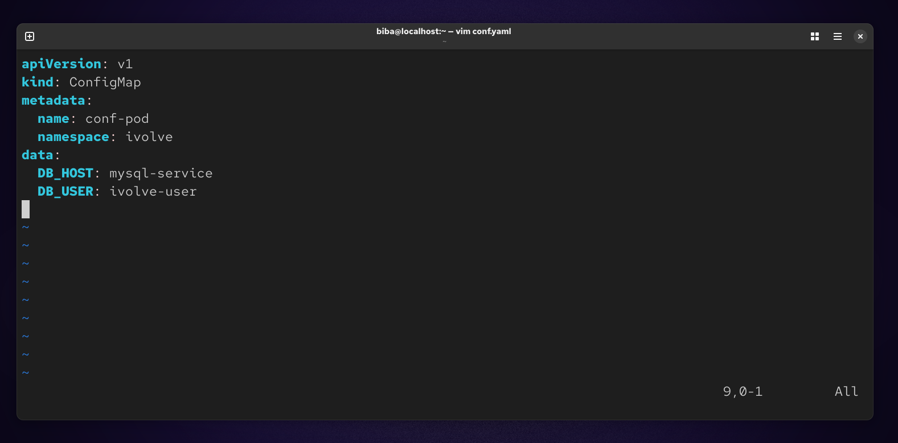
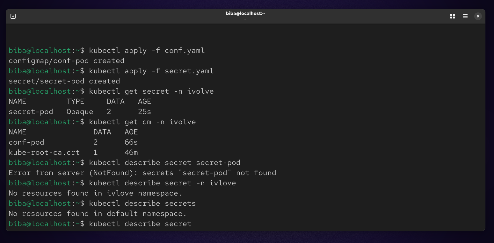
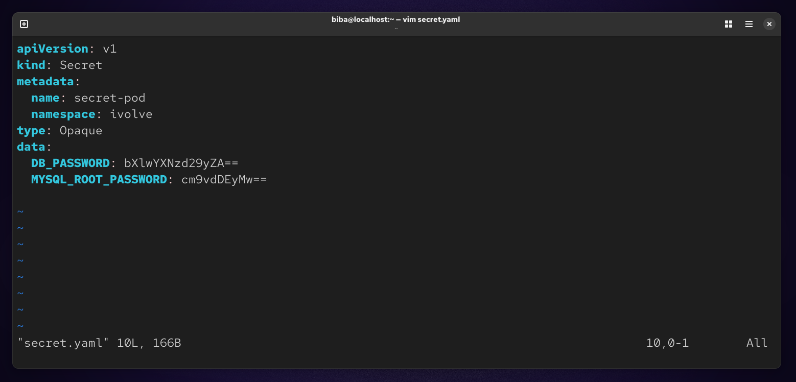
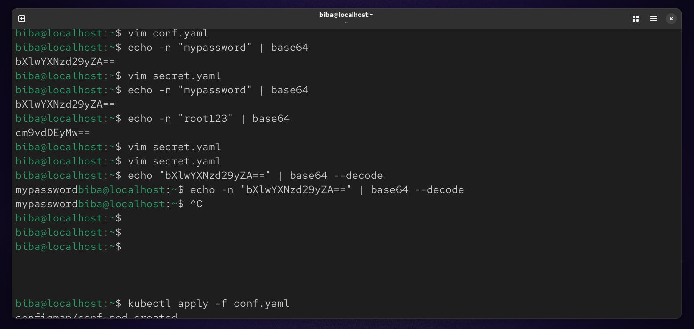
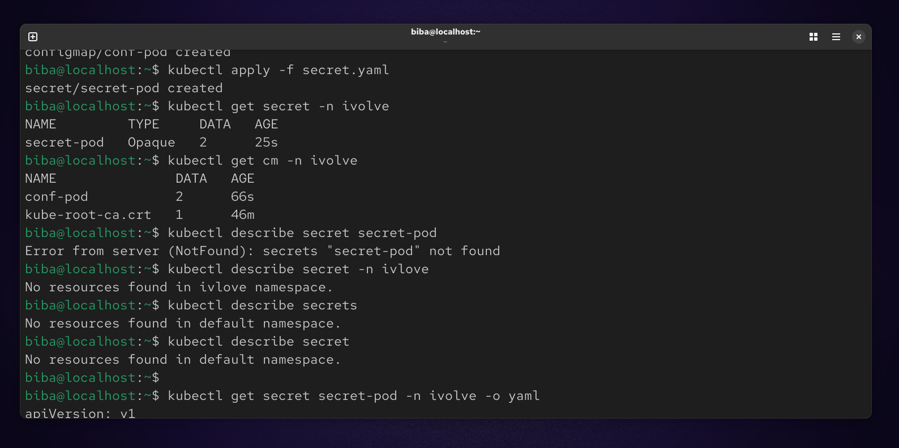

# 📦 Lab 12 : Managing Configuration and Sensitive Data in Kubernetes

## 🎯 Objective
In this lab, we learn how to manage application configuration and sensitive data in Kubernetes using:

- **ConfigMaps** → for non-sensitive data  
- **Secrets** → for sensitive data

## 🧩 Part 1: Create a Namespace

First, create a namespace to isolate resources:
```
kubectl create namespace ivolve
kubectl get namespace
```


## ⚙️ Part 2: ConfigMap (Non-Sensitive Data):
We store:

DB_HOST → MySQL service hostname

DB_USER → database user
```
vim conf.yaml
```


## 🚀 Apply ConfigMap
```
kubectl apply -f conf.yaml
```


## 🔐 Part 3: Secret (Sensitive Data)
We store:

DB_PASSWORD

MYSQL_ROOT_PASSWORD

⚠️ Kubernetes requires values to be base64 encoded
```
vim secret.yaml
```


## 🔄 Encode Values to Base64
```
echo -n "mypassword" | base64
# Output: bXlwYXNzd29yZA==

echo -n "root123" | base64
# Output: cm9vdDEyMw==
```


## 🚀 Apply Secret
```
kubectl apply -f secret.yaml
```



