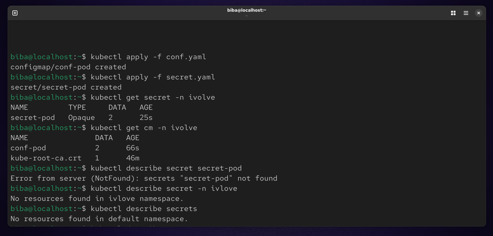

# 📦 Lab 12 : Managing Configuration and Sensitive Data in Kubernetes

## 🎯 Objective
In this lab, we learn how to manage application configuration and sensitive data in Kubernetes using:

- **ConfigMaps** → for non-sensitive data  
- **Secrets** → for sensitive data

## 🧩 Part 1: Create a Namespace

First, create a namespace to isolate resources:
```
kubectl create namespace ivolve
kubectl get namespace
```


## ⚙️ Part 2: ConfigMap (Non-Sensitive Data):
We store:

DB_HOST → MySQL service hostname

DB_USER → database user
```
vim conf.yaml
```


## 🚀 Apply ConfigMap
```
kubectl apply -f conf.yaml
```


## 🔐 Part 3: Secret (Sensitive Data)
We store:

DB_PASSWORD

MYSQL_ROOT_PASSWORD

⚠️ Kubernetes requires values to be base64 encoded
```
vim secret.yaml
```


## 🔄 Encode Values to Base64
```
echo -n "mypassword" | base64
# Output: bXlwYXNzd29yZA==

echo -n "root123" | base64
# Output: cm9vdDEyMw==
```


## 🚀 Apply Secret
```
kubectl apply -f secret.yaml
```


## 🔍 Verification
Check resources:
```
kubectl get configmap -n ivolve
kubectl get secret -n ivolve
```


## 📌 Summary

In this lab, we explored how to manage application configuration and sensitive data in Kubernetes using ConfigMaps and Secrets.

We created a dedicated namespace to organize resources, then defined a ConfigMap to store non-sensitive data such as the database host and user. After that, we created a Secret to securely handle sensitive information like database passwords, using Base64 encoding as required by Kubernetes.

Additionally, we learned how to apply these configurations to the cluster and how applications can consume them as environment variables.

This lab highlights the importance of separating configuration from code and demonstrates best practices for handling sensitive data in containerized environments.
