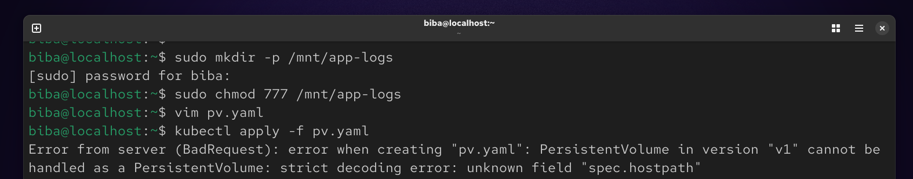
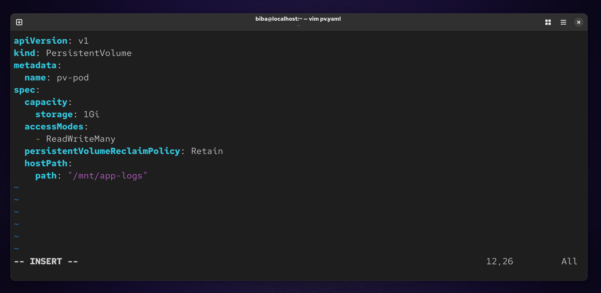
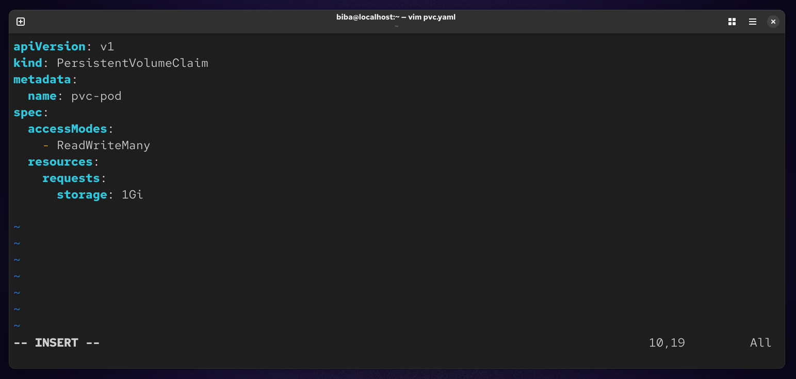
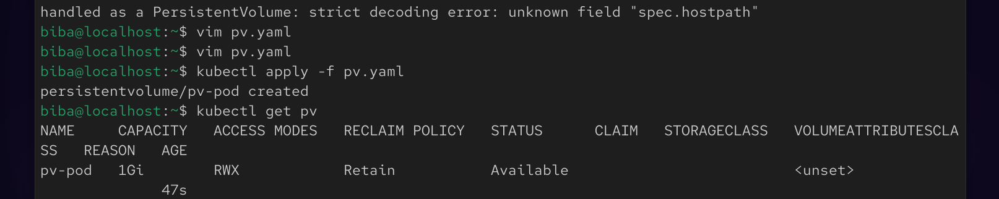
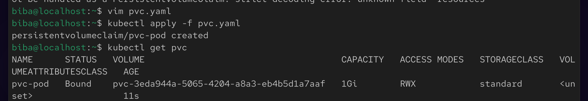
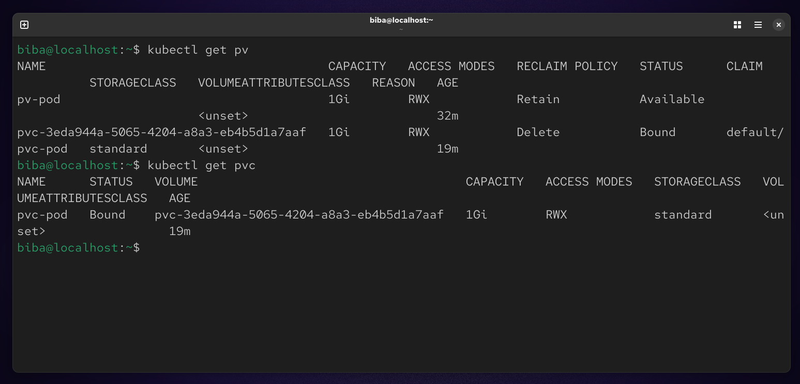

# 🚀 Lab 13 : Kubernetes Persistent Storage Lab

This project demonstrates how to configure persistent storage in Kubernetes using **Persistent Volumes (PV)** and **Persistent Volume Claims (PVC)** with the `hostPath` storage type.

## 📋 Scenario
We need to set up a persistent storage solution for application logging. The logs should be stored on the node's file system and remain available even if the Pod is deleted.

## 🛠️ Implementation Steps

### 1. Node Preparation
First, we create the physical directory on the worker node and set the appropriate permissions to allow Kubernetes to write data.
```
sudo mkdir -p /mnt/app-logs
sudo chmod 777 /mnt/app-logs
```


### 2. Define Persistent Volume (PV)
The PV represents the actual storage resource in the cluster.
```
vim pv.yaml
```


### 3. Define Persistent Volume Claim (PVC)
The PVC is the request for storage by the user/application.
```
vim pvc.yaml
```


### 🚀 Deployment Commands
Apply the configurations to your cluster:
```
kubectl apply -f pv.yaml
kubectl apply -f pvc.yaml
```




### 🔍 Verification
To ensure the storage is correctly provisioned and bound:
```
kubectl get pv
kubectl get pvc
```


### Summary 
Objective
The goal of this lab was to implement a persistent storage solution for application logging within a Kubernetes cluster. This ensures that log data is preserved independently of the Pod lifecycle.

Key Components Implemented
Host Preparation: Configured a local directory (/mnt/app-logs) on the node's file system with full 777 permissions to act as the physical storage backend.

Persistent Volume (PV): Defined a cluster-level resource named pv-pod with a 1Gi capacity, utilizing the hostPath type. It was configured with a Retain reclaim policy to ensure data safety upon claim deletion.

Persistent Volume Claim (PVC): Created a storage request named pvc-pod to consume the available PV.

Access Modes: Successfully matched the ReadWriteMany (RWX) access mode between the PV and PVC, allowing multiple pods to concurrently read from and write to the logging directory.

Outcome
The configuration was successfully validated using kubectl, confirming a Bound status between the PVC and PV. This setup provides a reliable, persistent path for containerized applications to store logs directly on the node's infrastructure.

