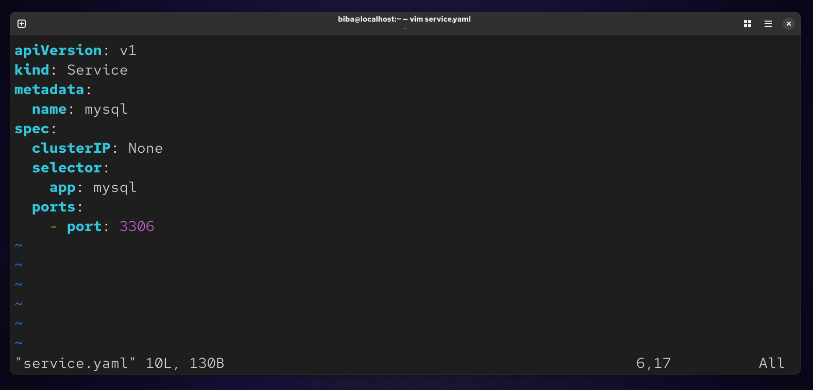
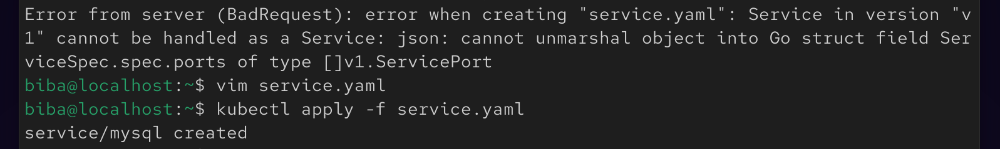
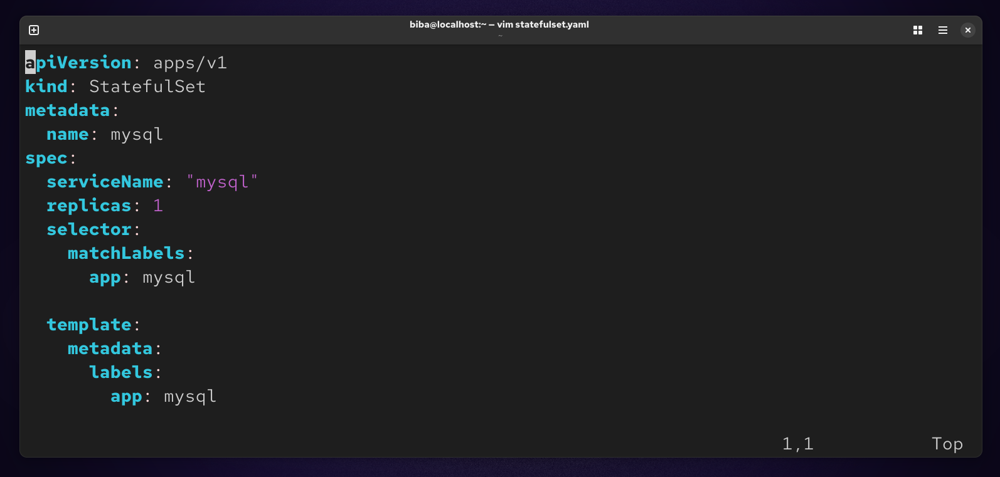
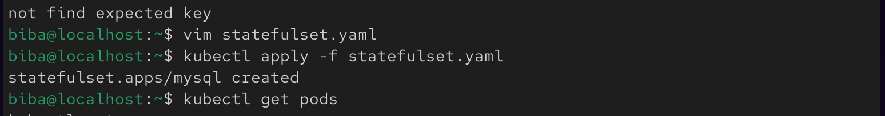
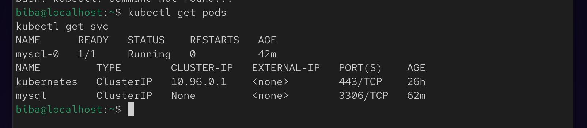
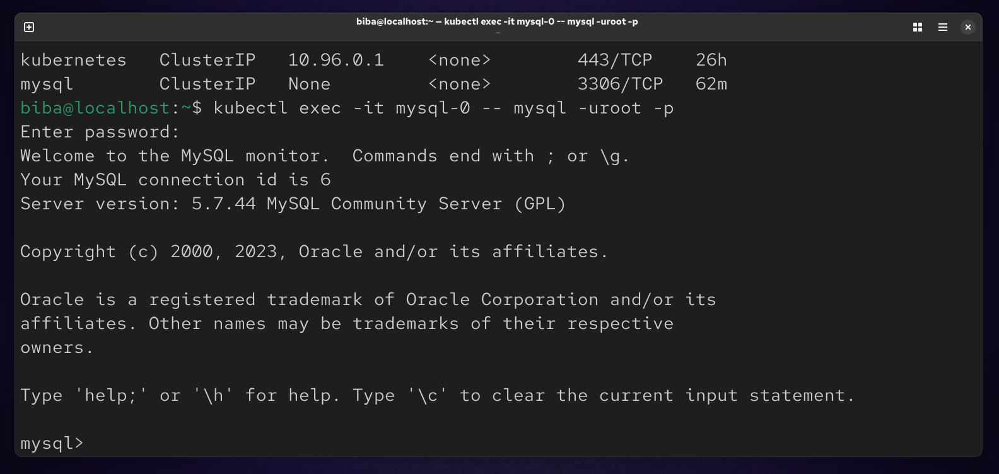

# 🚀 Lab 14 : StatefulSet with Headless Service (MySQL on Kubernetes)

## 📌 Overview
This lab demonstrates how to deploy a **stateful MySQL database** using Kubernetes with the following components:

- StatefulSet
- Headless Service
- Persistent Storage (PVC)
- Kubernetes Secret
- Tolerations

The goal is to ensure data persistence, stable networking, and secure configuration.

## 🧱 Architecture

The deployment consists of:

- **StatefulSet** → Manages MySQL pods with stable identity
- **Headless Service** → Provides stable DNS for pods
- **PersistentVolumeClaim** → Ensures data persistence
- **Secret** → Stores MySQL root password securely
- **Toleration** → Allows scheduling on tainted nodes

## 🔐 Step 1 : Create Secret
Store MySQL root password securely:
```
kubectl create secret generic mysql-secret --from-literal=root-password='12345'
```


## 💾 Step 2 : Create PersistentVolumeClaim
```
vim pvc.yaml
```


### Apply :
```
kubectl apply -f pvc.yaml
```


## 🌐 Step 3 : Create Headless Service
```
vim service.yaml
```


### Apply :
```
kubectl apply -f service.yaml
```


## 🗄️ Step 4 : Create StatefulSet
```
vim statefulset.yaml
```


### Apply :
```
kubectl apply -f statefulset.yaml
```


## ✅ Step 5 : Verify Deployment
```
kubectl get pods
kubectl get svc
```


## 🔍 Step 6 : Connect to MySQL
```
kubectl exec -it mysql-0 -- mysql -uroot -p
Enter password :
```

