# 🚀 Lab 15 : Node.js Application Deployment with ClusterIP Service (Kubernetes)

## 📌 Overview

This lab demonstrates how to deploy a **Node.js application on Kubernetes** using a Deployment and ClusterIP Service, while integrating key Kubernetes concepts such as:

- ConfigMap & Secret (environment variables)
- Persistent Volume (PV & PVC)
- Tolerations
- Namespaces
- Load balancing using ClusterIP Service

## 🧱 Architecture

The application is deployed using:

- **Deployment** → Runs Node.js app with 2 replicas
- **ClusterIP Service** → Internal load balancing
- **ConfigMap** → Non-sensitive environment variables
- **Secret** → Sensitive data (e.g., passwords)
- **PersistentVolume (PV)** → Static storage
- **PersistentVolumeClaim (PVC)** → Storage request
- **Toleration** → Allows scheduling on tainted nodes
- **Namespace** → Isolates resources (e.g., dev environment)

## 📦 Prerequisites

- Kubernetes cluster (Minikube / Kubeadm / Cloud)
- kubectl configured
- Docker image pushed to Docker Hub

### 🔐 Step 1 : Create ConfigMap from yaml.file
Stores non-sensitive environment variables:
```
vim configmap.yaml
```
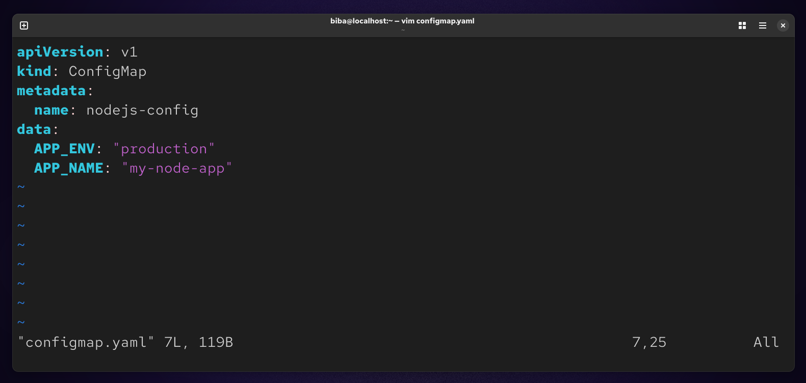

### Apply :
```
kubectl apply -f configmap.yaml
```
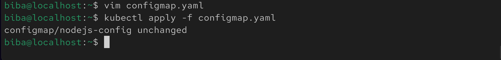

### 🔐 Step 2 : Create Secret
```
kubectl create secret generic nodejs-secret \
  --from-literal=DB_PASSWORD=123456
```
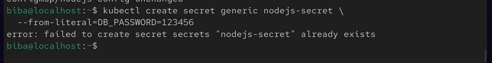

### 💾 Step 3 : Create Persistent Volume (PV)
```
vim pv.yaml
```
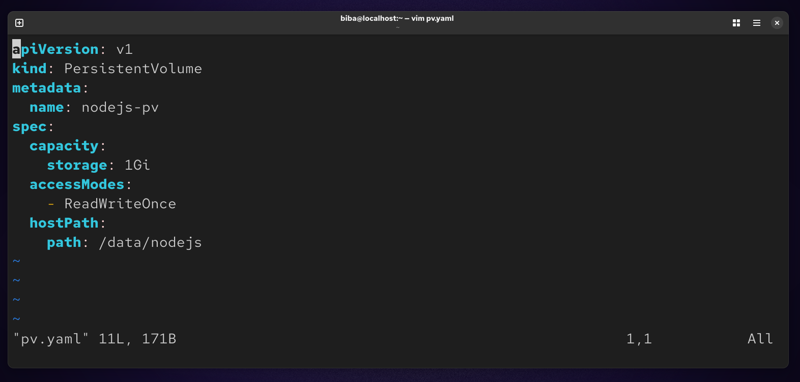

### Apply : 
```
kubectl apply -f pv.yaml
```
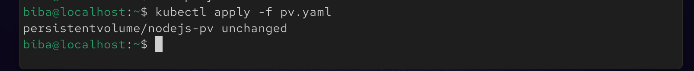

### 💾 Step 4 : Create PVC
```
vim pvc.yaml
```
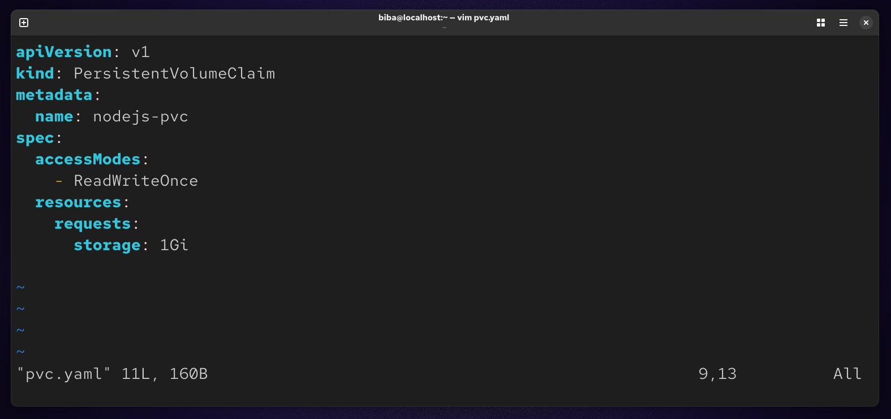

### Apply : 
```
kubectl apply -f pvc.yaml
```
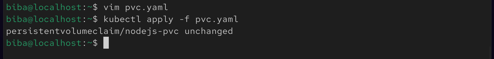

### 🚀 Step 5 : Create Deployment
```
vim deploy.yaml
```
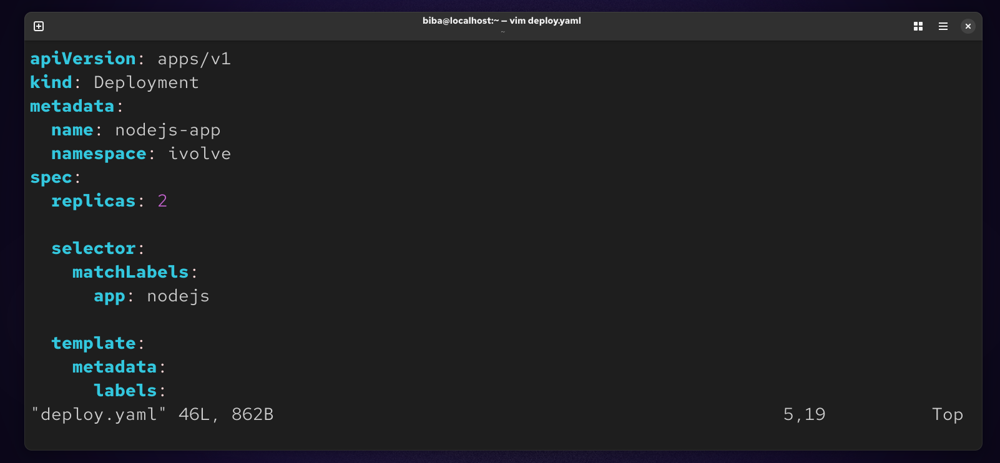

### Apply : 
```
kubectl apply -f deploy.yaml
```
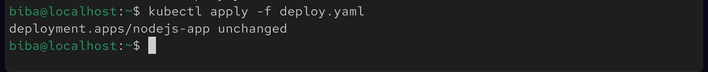

### 🌐 Step 6 : Expose Service (ClusterIP)
```
vim service.yaml
```
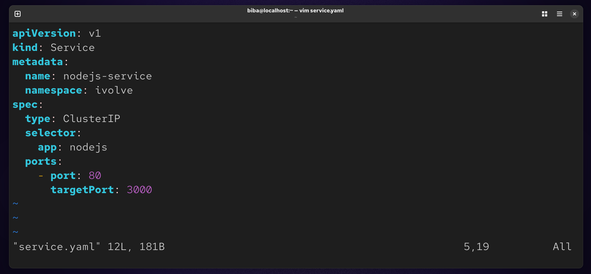

### Apply :
```
kubectl apply -f service.yaml
```
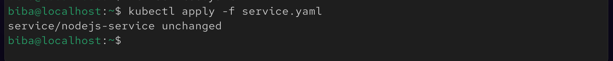

### 🔍 Step 7 : Verify Deployment
```
kubectl get pods -n ivolve
kubectl get svc -n ivolve
kubectl get all -n ivolve
```
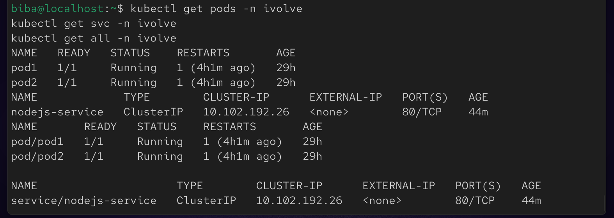

### 

