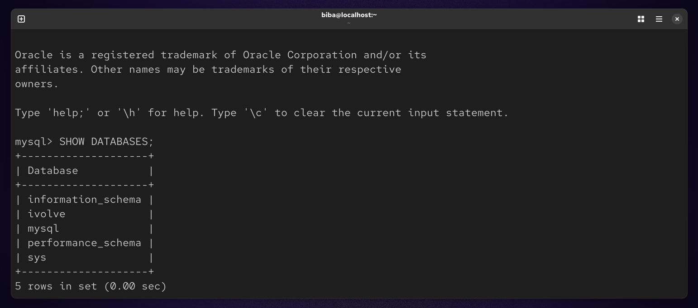
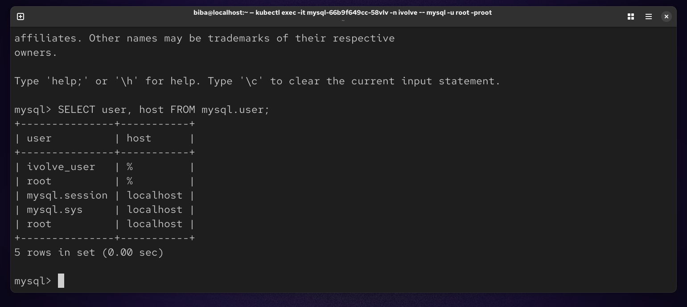

# 📘 Lab 16 : Kubernetes Init Container for Pre-Deployment Database Setup

## 🧾 Objective

Modify a Node.js Deployment to include an Init Container that prepares a MySQL database before the application starts.

The Init Container:

Uses MySQL client image
Creates database ivolve
Creates user ivolve_user
Grants full privileges

### 🚀 Step 1 : Create Namespace
```
kubectl create namespace ivolve
```


### 🐬 Step 2 : Deploy MySQL
```
vim mysql.yaml
```


### Apply : 
```
kubectl apply -f mysql.yaml
```


### ⚙️ Step 3 : Create ConfigMap
```
vim config.yaml
```


### Apply :
```
kubectl apply -f config.yaml
```


### 🔐 Step 4 : Create Secret
```
vim secret.yaml
```


### Apply :
```
kubectl apply -f secret.yaml
```


### 🚀 Step 5 : Node.js Deployment with Init Container
```
vim deploy.yaml
```


### Apply : 
```
kubectl apply -f deploy.yaml
```


### 👀 Step 6 : Check Pods
```
kubectl get pods -n ivolve
```


### 🧪 Step 7 : Verify MySQL
```
kubectl exec -it mysql-66b9f649cc-58vlv -n ivolve -- mysql -u root -proot
SHOW DATABASES;
SELECT user, host FROM mysql.user;
```




### 📌 Summary 

This lab demonstrates how to use an Init Container in Kubernetes to prepare a database environment before starting an application.

A MySQL pod is deployed using MySQL, along with a Node.js application using Node.js. The Init Container runs before the main container and ensures the database is ready.

It connects to MySQL using credentials provided via ConfigMap and Secret, then:

Creates a database named ivolve
Creates a user ivolve_user
Grants full privileges on the database

After successful execution, the Node.js container starts normally.

🧠 Key Idea

Init Containers ensure that all dependencies (like databases) are fully ready before the application starts, improving reliability and preventing startup failures.

