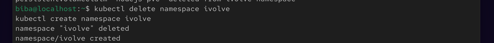
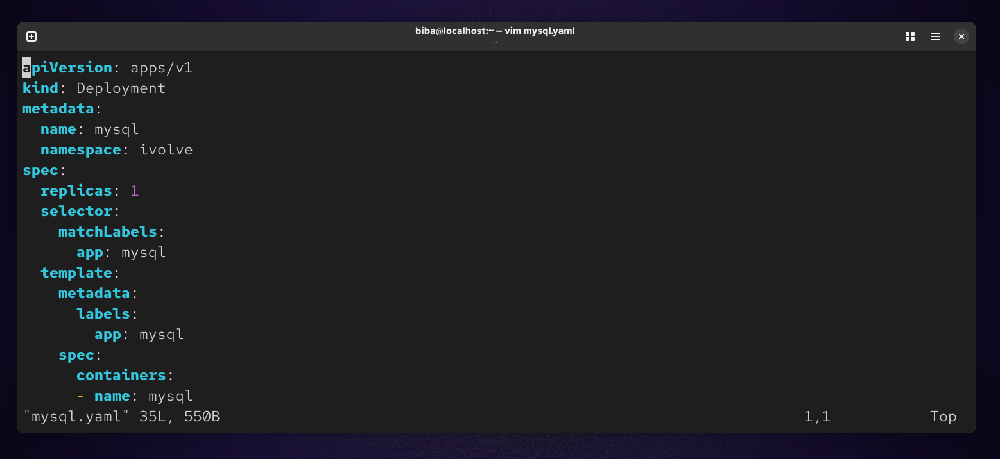
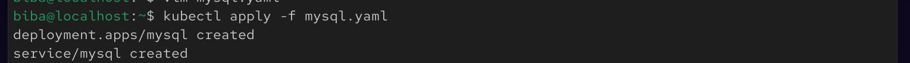
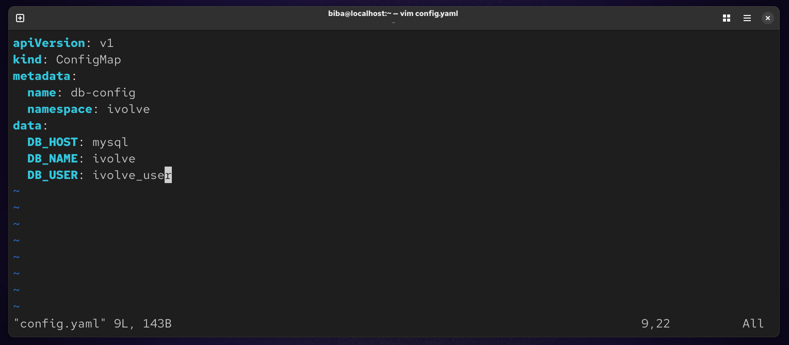
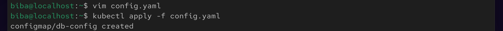
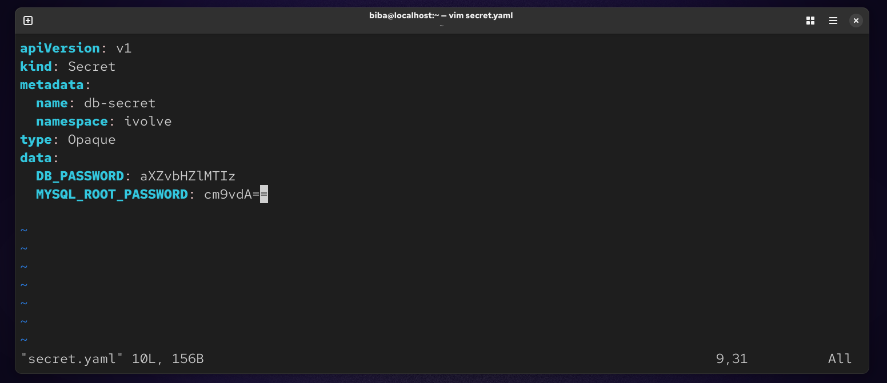
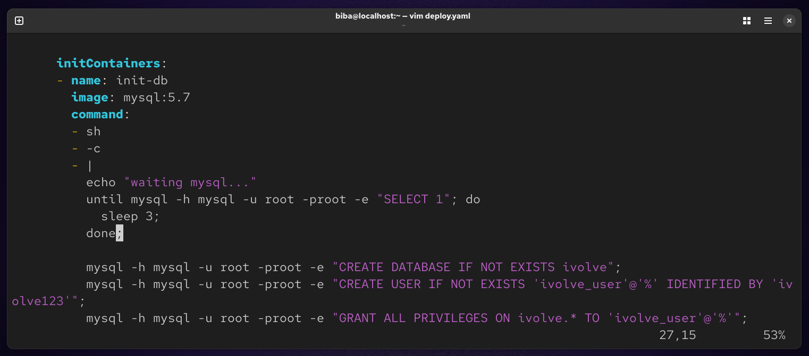
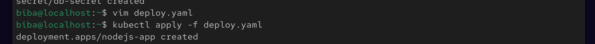
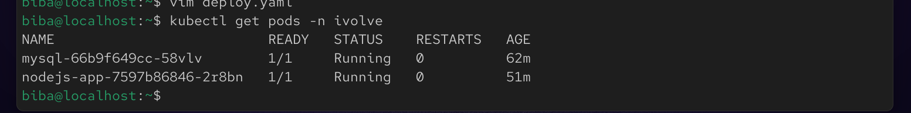

# 📘 Lab 16 : Kubernetes Init Container for Pre-Deployment Database Setup

## 🧾 Objective

Modify a Node.js Deployment to include an Init Container that prepares a MySQL database before the application starts.

The Init Container:

Uses MySQL client image
Creates database ivolve
Creates user ivolve_user
Grants full privileges

### 🚀 Step 1 : Create Namespace
```
kubectl create namespace ivolve
```


### 🐬 Step 2 : Deploy MySQL
```
vim mysql.yaml
```


### Apply : 
```
kubectl apply -f mysql.yaml
```


### ⚙️ Step 3 : Create ConfigMap
```
vim config.yaml
```


### Apply :
```
kubectl apply -f config.yaml
```


### 🔐 Step 4 : Create Secret
```
vim secret.yaml
```


### Apply :
```
kubectl apply -f secret.yaml
```


### 🚀 Step 5 : Node.js Deployment with Init Container
```
vim deploy.yaml
```


### Apply : 
```
kubectl apply -f deploy.yaml
```


### 👀 Step 6 : Check Pods
```
kubectl get pods -n ivolve
```


