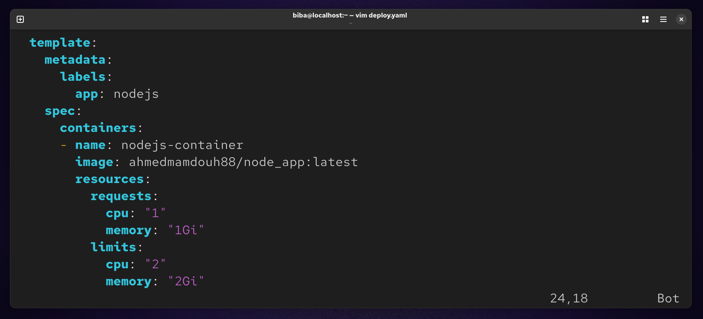
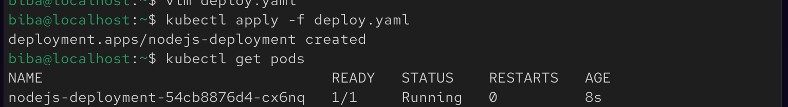

# 🚀 Lab 17 : Pod Resource Management (CPU & Memory)

## 📌 Overview
This lab demonstrates how to manage Kubernetes pod resources using **requests** and **limits** for CPU and memory. It also covers how to verify and monitor resource usage in real time.

## 🎯 Objectives
- Update an existing Deployment to include resource requests and limits
- Understand the difference between requests and limits
- Verify applied configurations
- Monitor real-time resource usage

## 🧠 Key Concepts

### 🔹 Requests
Minimum resources guaranteed for a container.

### 🔹 Limits
Maximum resources a container is allowed to consume.

## ⚙️ Configuration

### Resource Requirements

| Resource | Requests| Limits |
|----------|---------|--------|
| CPU      | 1 vCPU  | 2 vCPU |
| Memory   | 1Gi     | 2Gi    |

### 🛠️ Deployment Example
```
vim deploy.yaml
```


### Apply : 
```
kubectl apply -f deploy.yaml
```



