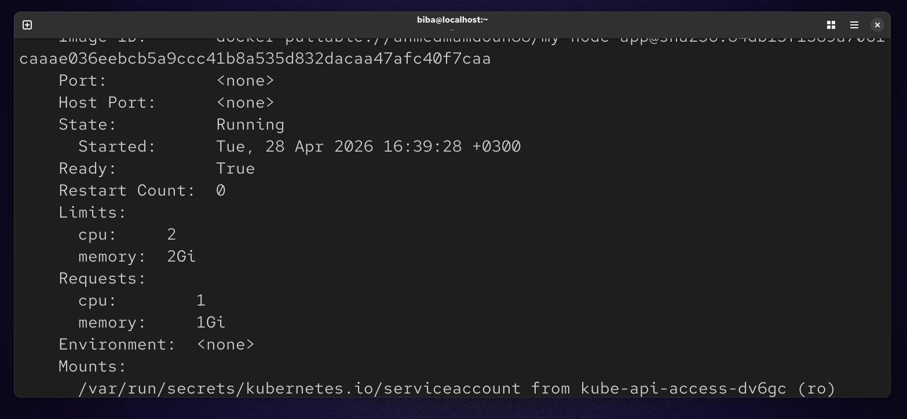
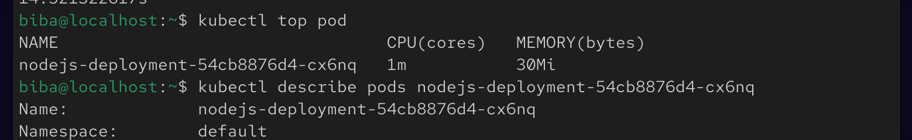

# 🚀 Lab 17 : Pod Resource Management (CPU & Memory)

## 📌 Overview
This lab demonstrates how to manage Kubernetes pod resources using **requests** and **limits** for CPU and memory. It also covers how to verify and monitor resource usage in real time.

## 🎯 Objectives
- Update an existing Deployment to include resource requests and limits
- Understand the difference between requests and limits
- Verify applied configurations
- Monitor real-time resource usage

## 🧠 Key Concepts

### 🔹 Requests
Minimum resources guaranteed for a container.

### 🔹 Limits
Maximum resources a container is allowed to consume.

## ⚙️ Configuration

### Resource Requirements

| Resource | Requests| Limits |
|----------|---------|--------|
| CPU      | 1 vCPU  | 2 vCPU |
| Memory   | 1Gi     | 2Gi    |

### 🛠️ Deployment Example
```
vim deploy.yaml
```


### Apply : 
```
kubectl apply -f deploy.yaml
```


### 🔍 Verification 
```
kubectl describe pod nodejs-deployment-54cb8876d4-cx6nq
```


### 📊 Monitor Resource Usage
```
kubectl top pod
```


### 📌 Summary

In this lab, we configured resource management for a Kubernetes Deployment by defining CPU and memory requests and limits. This ensures that each pod gets the minimum resources it needs while preventing it from consuming excessive resources.

We applied the configuration using kubectl, verified the settings with kubectl describe pod, and monitored real-time usage using kubectl top pod after enabling the metrics server.

This lab highlights the importance of proper resource allocation in Kubernetes to achieve better performance, stability, and efficient cluster utilization.


