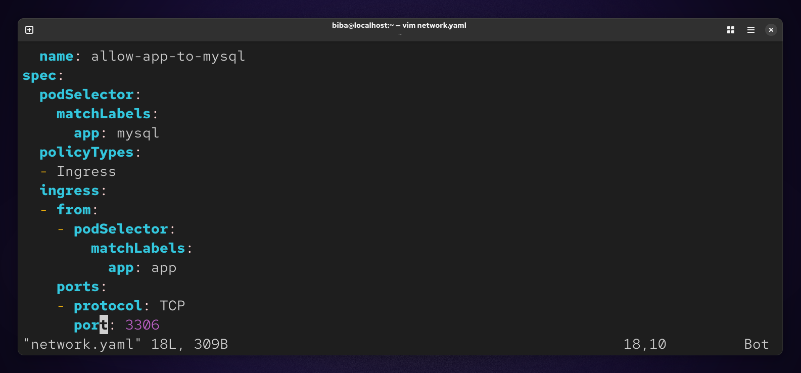
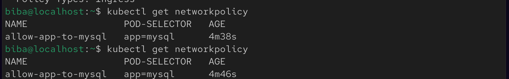
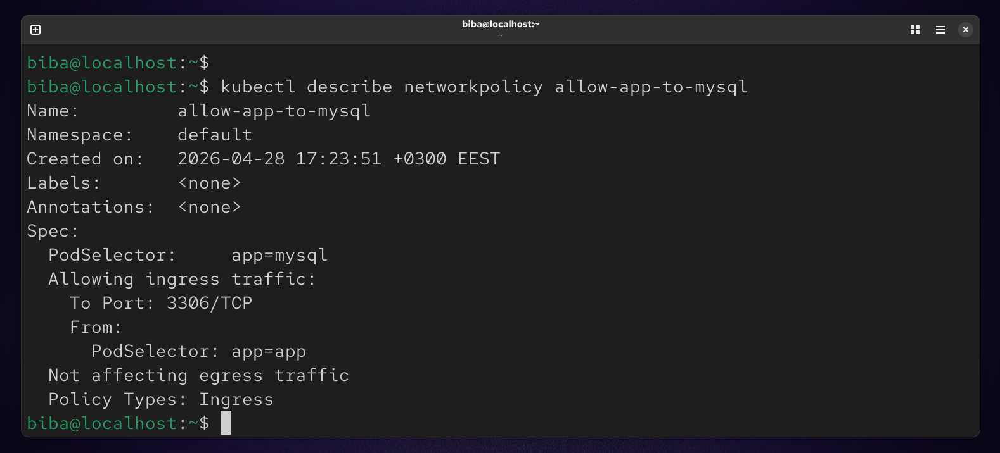

# 🚀 Lab 18 : Control Pod-to-Pod Traffic using Network Policy


## 🎯 Objectives
- Create a NetworkPolicy resource
- Restrict access to MySQL pods
- Allow traffic only from application pods
- Limit access to port 3306 (MySQL default port)

## 🧠 Key Concepts

### 🔹 NetworkPolicy
A Kubernetes resource used to control how pods communicate with each other and external endpoints.

### 🔹 Ingress Traffic
Incoming traffic to a pod.

## ⚙️ Network Policy Configuration

### 📌 Policy Details

| Field        | Value                |
|--------------|---------------------|
| Name         | allow-app-to-mysql  |
| Pod Selector | app=mysql           |
| Policy Type  | Ingress only        |
| Port         | 3306                |

### 🛠️ NetworkPolicy YAML
```
vim network.yaml
```


### Apply : 
kubectl apply -f network.yaml
```
kubectl apply -f network.yaml
```


### 🔍 Verification
```
kubectl get networkpolicy
```


### Describe Policy
```
kubectl describe networkpolicy allow-app-to-mysql
```


### 📌 Summary

In this lab, we implemented a Kubernetes NetworkPolicy to control pod-to-pod communication and enhance cluster security. We created a policy named allow-app-to-mysql that targets MySQL pods and restricts access to only application pods.

The policy allows ingress traffic only on port 3306, ensuring that no other pods in the cluster can access the MySQL service. This demonstrates how NetworkPolicies help enforce isolation and secure communication between services inside a Kubernetes cluster.

