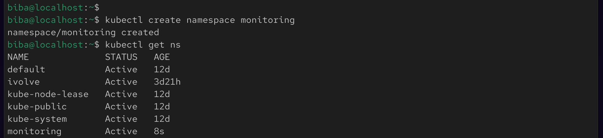
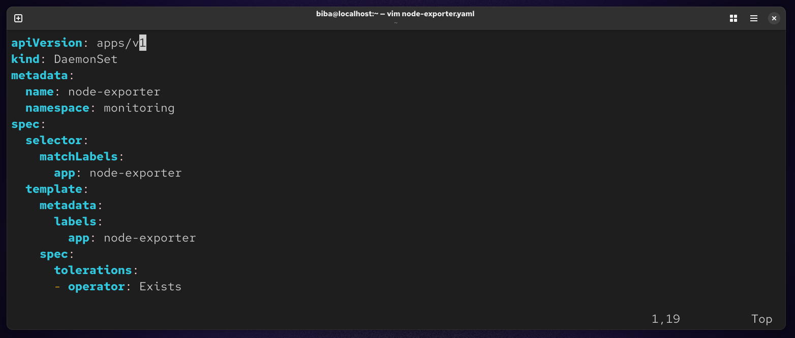
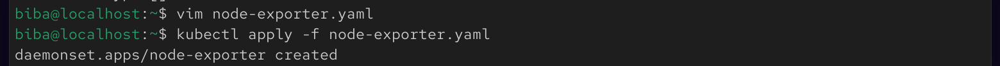
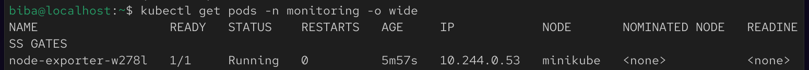
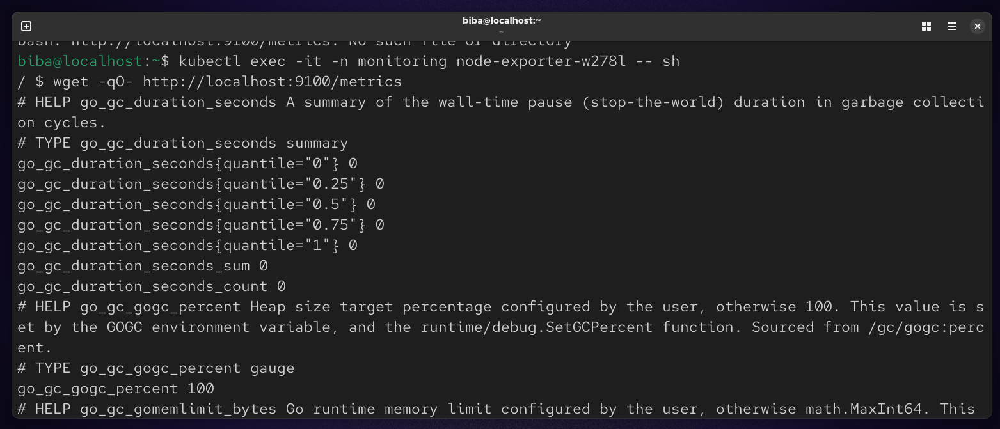

# 🚀 Lab 19 : Node-Wide Pod Management with DaemonSet

## 📌 Objective

Learn how to use a DaemonSet in Kubernetes to ensure a Pod runs on every node in the cluster using node-exporter for monitoring.

## 🧠 Key Concepts
🔹 DaemonSet

A DaemonSet guarantees that one Pod is deployed on each node.

Use cases:

Monitoring agents (e.g., node-exporter)
Logging agents
Security tools

## 🛠️ Implementation Steps

### ✅ 1. Create Namespace
✅ 1. Create Namespace
```
kubectl create namespace monitoring
```


### ✅ 2. Create DaemonSet
```
vim node-exporter.yaml
```


#### Apply :
```
kubectl apply -f node-exporter.yaml
```


### ✅ 3. Verify Deployment
```
kubectl get pods -n monitoring -o wide
```


### ✅ 4. Access Metrics

#### 🔹 Inside the Pod
```
kubectl exec -it -n monitoring node-exporter-w278l -- sh
wget -qO- http://localhost:9100/metrics
```


### 📌 Summary

In this lab, you successfully deployed a **DaemonSet** to run the **node-exporter** on every node in the Kubernetes cluster. This demonstrated how DaemonSets ensure consistent Pod placement across all nodes, making them ideal for cluster-wide services like monitoring and logging.

You verified that:

* The DaemonSet created one Pod per node
* Each Pod was running successfully
* The metrics endpoint was accessible via multiple methods (port-forward, in-pod access, and NodePort)

By completing this lab, you now understand how to:

* Use DaemonSets for node-level workloads
* Expose and validate service metrics
* Troubleshoot connectivity issues in Kubernetes

This setup serves as a foundational step toward integrating full monitoring solutions such as Prometheus and Grafana.


