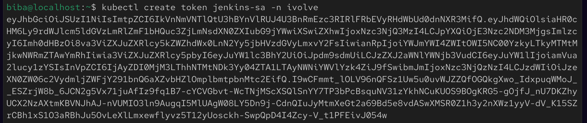
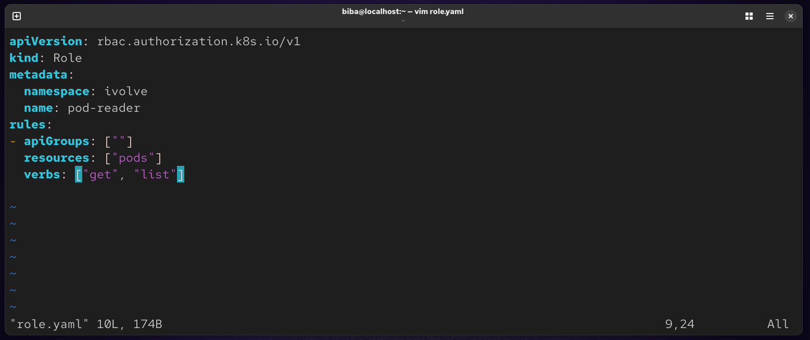
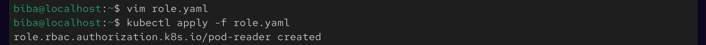
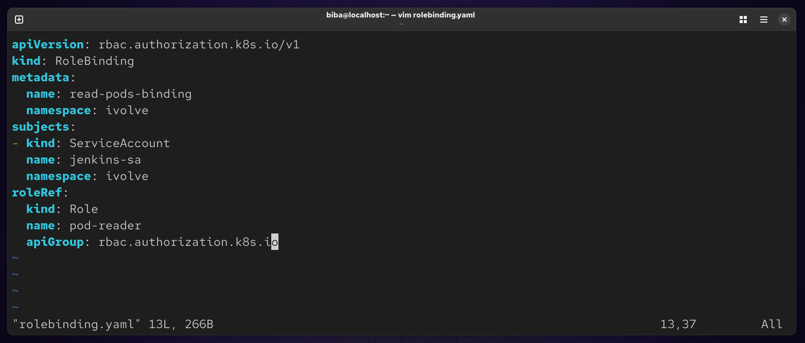
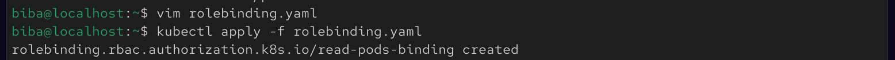
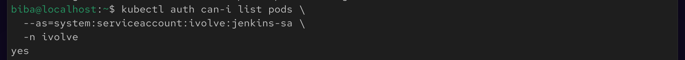
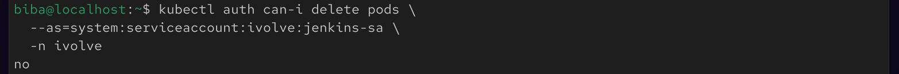

# 🔐 Lab 20 : Securing Kubernetes with RBAC and Service Accounts

## 📌 Objective

In this lab, we will secure Kubernetes access using RBAC (Role-Based Access Control) by:

Creating a ServiceAccount
Defining a Role with limited permissions
Binding the Role to the ServiceAccount
Validating restricted access to cluster resources

## 🧠 Key Concepts
🔹 RBAC (Role-Based Access Control)

RBAC is a security mechanism in Kubernetes that controls:

Who can access the cluster (ServiceAccount)
What they can do (Role)
Where they can do it (Namespace scope)
Binding between them (RoleBinding)

## 🛠️ Implementation Steps

### ✅ 1. Create Namespace
```
kubectl create namespace ivolve
```


### ✅ 2. Create ServiceAccount
```
kubectl create serviceaccount jenkins-sa -n ivolve
kubectl get sa -n ivolve
```


### ✅ 3. Generate ServiceAccount Token
```
kubectl create token jenkins-sa -n ivolve
```


### ✅ 4. Create Role (Read-Only Access)
```
vim role.yaml
```


### Apply :
```
kubectl apply -f role.yaml
```


### ✅ 5. Create RoleBinding
```
vim rolebending.yaml
```


### Apply :
```
kubectl apply -f rolebinding.yaml
```


### 🧪 Validation

#### ✅ Check allowed actions
```
kubectl auth can-i list pods \
--as=system:serviceaccount:ivolve:jenkins-sa \
-n ivolve
```


#### ❌ Check restricted actions
```
kubectl auth can-i delete pods \ --as=system:serviceaccount:ivolve:jenkins-sa \ -n ivolve
```


### 🧾 Summary
In this lab, we implemented Kubernetes RBAC (Role-Based Access Control) to control access to cluster resources in a secure and restricted way.
We started by creating a dedicated namespace ivolve to isolate the resources. Then we created a ServiceAccount called jenkins-sa which acts as an identity inside the cluster.
After that, we generated a token for the ServiceAccount to be used for authentication. Next, we defined a Role named pod-reader that gives read-only permissions (get, list) on pods within the ivolve namespace.
Then we created a RoleBinding to connect the ServiceAccount with the Role, allowing jenkins-sa to use those permissions.
Finally, we validated the setup using kubectl auth can-i commands, where the ServiceAccount was able to list pods but was correctly denied from deleting them, confirming that RBAC is working as expected.
This lab demonstrates how Kubernetes RBAC helps enforce least privilege access, improve cluster security, and control what users or applications can do inside specific namespaces.
