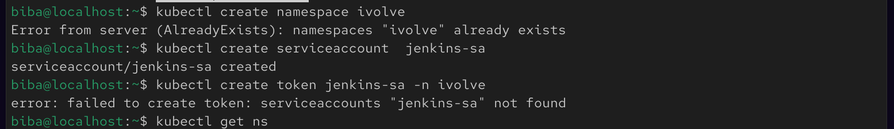
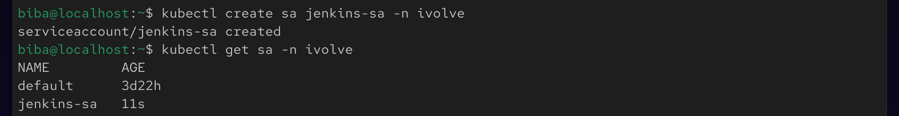

# 🔐 Lab 20 : Securing Kubernetes with RBAC and Service Accounts

## 📌 Objective

In this lab, we will secure Kubernetes access using RBAC (Role-Based Access Control) by:

Creating a ServiceAccount
Defining a Role with limited permissions
Binding the Role to the ServiceAccount
Validating restricted access to cluster resources

## 🧠 Key Concepts
🔹 RBAC (Role-Based Access Control)

RBAC is a security mechanism in Kubernetes that controls:

Who can access the cluster (ServiceAccount)
What they can do (Role)
Where they can do it (Namespace scope)
Binding between them (RoleBinding)

## 🛠️ Implementation Steps

### ✅ 1. Create Namespace
```
kubectl create namespace ivolve
```


### ✅ 2. Create ServiceAccount
```
kubectl create serviceaccount jenkins-sa -n ivolve
kubectl get sa -n ivolve
```


