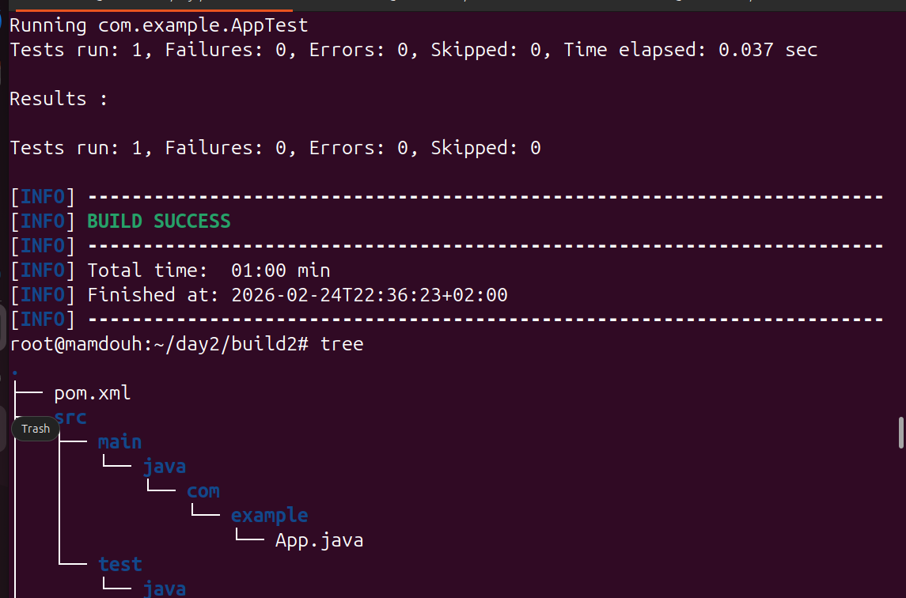

# Lab 2: Building and Packaging Java Applications with Maven

This project demonstrates the fundamental workflow of a DevOps engineer or Java developer using **Apache Maven**. It covers the entire lifecycle from cloning the source code to running unit tests, packaging the application, and executing the final artifact.

---

## 📋 Prerequisites

Before you begin, ensure you have the following installed:
* **Java Development Kit (JDK):** Version 8 or higher.
* **Apache Maven:** Version 3.6.x or higher.
* **Git:** To clone the repository.

---

## 🚀 Steps to Reproduce

### 1. Install Maven
If you haven't installed Maven yet, follow these commands (for Ubuntu/Linux):
```bash
sudo apt update
sudo apt install maven -y
mvn -version
